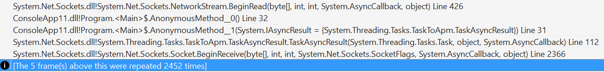
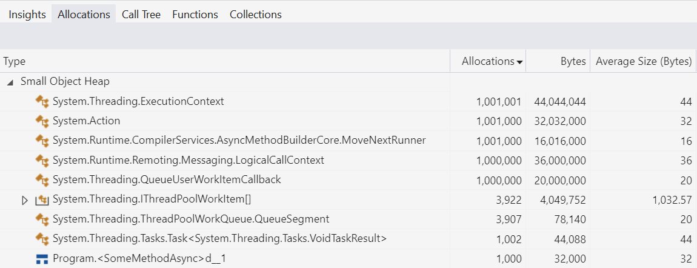
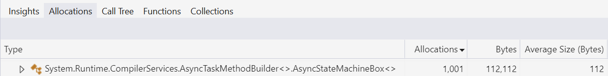

# How Async/Await Really Works in C#

[文章](https://devblogs.microsoft.com/dotnet/how-async-await-really-works/)

几周前，.NET 博客上发布了一篇文章 什么是 .NET，为什么选择它？。它提供了一个平台的高层概述，总结了各种组件和设计决策，并承诺在涉及的领域中提供更深入的文章。这篇文章是第一个这样的后续文章，深入探讨了 C# 和 .NET 中 async/await 的历史、背后的设计决策以及实现细节。

对 async/await 的支持已经有十多年的历史了。在此期间，它改变了如何编写 .NET 的可扩展代码，而且在不了解底层究竟发生了什么的情况下使用这个功能是非常可行且极为普遍的。首先，我们有一个如下的同步方法（这个方法是“同步”的，因为调用者在整个操作完成并将控制权返回给调用者之前无法做任何其他事情）：

```csharp
// Synchronously copy all data from source to destination.
public void CopyStreamToStream(Stream source, Stream destination)
{
    var buffer = new byte[0x1000];
    int numRead;
    while ((numRead = source.Read(buffer, 0, buffer.Length)) != 0)
    {
        destination.Write(buffer, 0, numRead);
    }
}
```

然后，您添加一些关键字，更改一些方法名称，最后得到以下异步方法（这个方法是“异步”的，因为控制权预计将很快返回给调用者，甚至可能在与整个操作相关的工作完成之前）：

```csharp
// Asynchronously copy all data from source to destination.
public async Task CopyStreamToStreamAsync(Stream source, Stream destination)
{
    var buffer = new byte[0x1000];
    int numRead;
    while ((numRead = await source.ReadAsync(buffer, 0, buffer.Length)) != 0)
    {
        await destination.WriteAsync(buffer, 0, numRead);
    }
}
```

语法几乎相同，仍然可以使用所有相同的控制流构造，但现在是非阻塞的，具有完全不同的底层执行模型，所有繁重的工作都由 C# 编译器和核心库在幕后为您完成。

虽然在不了解底层究竟发生了什么的情况下使用这个支持是很常见的，但我坚信，理解事物的实际运作原理有助于更好地利用它。对于 async/await，特别是当您想深入了解底层，比如在试图调试出问题的事物或改善其他正常事物的性能时，理解所涉及的机制尤为有益。因此，在这篇文章中，我们将深入探讨 await 在语言、编译器和库级别的工作原理，以便您充分利用这些宝贵的功能。

然而，要做好这件事，我们需要回到 async/await 之前，了解在没有它的情况下，最先进的异步代码是什么样子的。公平警告，那可不是什么好看的东西。

## 开始的时候

回到 .NET Framework 1.0，有一种异步编程模型模式，也称为 APM 模式，又称为 Begin/End 模式，又称为 IAsyncResult 模式。从高层次来看，这种模式很简单。对于一个同步操作 DoStuff

```csharp
class Handler
{
    public int DoStuff(string arg);
}
```

模式中有两个对应的方法：一个 BeginDoStuff 方法和一个 EndDoStuff 方法：

```csharp
class Handler
{
    public int DoStuff(string arg);

    public IAsyncResult BeginDoStuff(string arg, AsyncCallback? callback, object? state);
    public int EndDoStuff(IAsyncResult asyncResult);
}
```

BeginDoStuff 会接受与 DoStuff 相同的所有参数，但除此之外，它还会接受一个 AsyncCallback 委托和一个不透明的状态对象，这两者中的一个或两者都可以为空。Begin 方法负责启动异步操作，如果提供了回调（通常称为初始操作的“延续”），它还要确保在异步操作完成时调用回调。Begin 方法还将构造一个实现了 IAsyncResult 的类型的实例，并使用可选的状态填充 IAsyncResult 的 AsyncState 属性：

```csharp
namespace System
{
    public interface IAsyncResult
    {
        object? AsyncState { get; }
        WaitHandle AsyncWaitHandle { get; }
        bool IsCompleted { get; }
        bool CompletedSynchronously { get; }
    }

    public delegate void AsyncCallback(IAsyncResult ar);
}
```

然后，这个 IAsyncResult 实例既会从 Begin 方法返回，也会在最终调用时传递给 AsyncCallback。当准备使用操作的结果时，调用者将把 IAsyncResult 实例传递给 End 方法，该方法负责确保操作已完成（如果尚未完成，则通过阻塞同步等待它完成），然后返回操作的任何结果，包括传播可能发生的任何错误/异常。因此，为了同步执行操作，我们不再像下面这样编写代码：

```csharp
try
{
    int i = handler.DoStuff(arg);
    Use(i);
}
catch (Exception e)
{
    ... // handle exceptions from DoStuff and Use
}
```

可以使用如下方式利用 Begin/End 方法异步执行相同操作：

```csharp
try
{
    handler.BeginDoStuff(arg, iar =>
    {
        try
        {
            Handler handler = (Handler)iar.AsyncState!;
            int i = handler.EndDoStuff(iar);
            Use(i);
        }
        catch (Exception e2)
        {
            ... // handle exceptions from EndDoStuff and Use
        }
    }, handler);
}
catch (Exception e)
{
    ... // handle exceptions thrown from the synchronous call to BeginDoStuff
}
```

对于在任何语言中处理基于回调的 API 的人来说，这应该是非常熟悉的。

然而，随后的问题变得更加复杂。例如，“堆栈潜入”问题。堆栈潜入是指代码反复进行深入堆栈的调用，以至于可能会发生堆栈溢出。如果操作同步完成，Begin 方法允许同步调用回调，这意味着调用 Begin 的过程本身可能直接调用回调。实际上，“异步”完成的操作非常常见；它们之所以被称为“异步”，并不是因为它们保证异步完成，而是因为它们被允许异步完成。例如，考虑从某个网络操作（如从套接字接收数据）进行异步读取。如果每个单独操作只需要少量数据，例如从响应中读取一些头数据，你可以放置一个缓冲区以避免大量系统调用的开销。你可以在缓冲区中执行较大的读取操作，然后从缓冲区中消耗数据，直到它耗尽；这样可以减少与套接字实际交互所需的昂贵系统调用次数。这样的缓冲区可能位于你使用的异步抽象之后，这样第一个“异步”操作（填充缓冲区）会异步完成，但是在底层缓冲区耗尽之前的所有后续操作实际上都不需要进行任何 I/O，只需从缓冲区中提取数据，因此都可以同步完成。当 Begin 方法执行这些操作之一并发现它同步完成时，它可以同步调用回调。这意味着你有一个调用 Begin 方法的堆栈帧，另一个 Begin 方法本身的堆栈帧，现在还有一个回调的堆栈帧。现在，如果回调转过来再次调用 Begin 会发生什么？如果该操作同步完成并同步调用回调，那么你现在又在堆栈上深入了几个帧。如此这般，直到最终用完堆栈。

这是一个真实存在且容易重现的问题。尝试在 .NET Core 上运行这个程序：

```csharp
using System.Net;
using System.Net.Sockets;

using Socket listener = new Socket(AddressFamily.InterNetwork, SocketType.Stream, ProtocolType.Tcp);
listener.Bind(new IPEndPoint(IPAddress.Loopback, 0));
listener.Listen();

using Socket client = new Socket(AddressFamily.InterNetwork, SocketType.Stream, ProtocolType.Tcp);
client.Connect(listener.LocalEndPoint!);

using Socket server = listener.Accept();
_ = server.SendAsync(new byte[100_000]);

var mres = new ManualResetEventSlim();
byte[] buffer = new byte[1];

var stream = new NetworkStream(client);

void ReadAgain()
{
    stream.BeginRead(buffer, 0, 1, iar =>
    {
        if (stream.EndRead(iar) != 0)
        {
            ReadAgain(); // uh oh!
        }
        else
        {
            mres.Set();
        }
    }, null);
};
ReadAgain();

mres.Wait();
```

在这里，我设置了一个简单的客户端套接字和服务器套接字相互连接。服务器向客户端发送 100,000 字节，然后客户端使用 BeginRead/EndRead 一次一个地“异步”地消耗它们（这是非常低效的，只是为了教学的目的）。传递给 BeginRead 的回调通过调用 EndRead 完成读取，然后如果它成功读取了所需的字节（在这种情况下，它还没有到达流的末尾），它会通过对 ReadAgain 本地函数的递归调用发出另一个 BeginRead。然而，在 .NET Core 中，套接字操作比在 .NET Framework 上要快得多，如果操作系统能够同步满足操作，那么它们将同步完成（注意内核本身有一个用于满足套接字接收操作的缓冲区）。因此，这个堆栈会溢出：



所以，这种补偿被构建到了 APM 模型中。有两种可能的补偿方法：

不允许 AsyncCallback 同步调用。如果它总是异步调用的，即使操作同步完成，堆栈溢出的风险也会消失。但性能也会消失，因为同步完成的操作（或者说速度如此之快以至于观察上无法区分）非常常见，强制每个这样的操作将回调加入队列会增加可测量的开销。
使用一种机制，如果操作同步完成，则允许调用者而不是回调执行后续工作。这样，您可以避免额外的方法帧，并继续在堆栈上进行后续工作。
APM 模式采用了选项（2）。为此，IAsyncResult 接口暴露了两个相关但截然不同的成员：IsCompleted 和 CompletedSynchronously。IsCompleted 告诉你操作是否已完成：你可以多次检查它，最终它会从 false 变为 true，然后保持在那里。相比之下，CompletedSynchronously 从不改变（或者如果它改变了，那就是一个等待发生的严重错误）；它用于在调用 Begin 方法的调用者和 AsyncCallback 之间传递哪个负责执行后续工作。如果 CompletedSynchronously 为 false，那么操作将异步完成，应该由回调来执行任何响应操作完成的后续工作；毕竟，如果工作没有同步完成，Begin 的调用者无法真正处理它，因为操作尚未完成（如果调用者只是调用 End，它会阻塞直到操作完成）。然而，如果 CompletedSynchronously 为 true，那么如果回调处理后续工作，就有可能导致堆栈溢出，因为它会在堆栈上比开始时更深的地方执行后续工作。因此，所有关心这种堆栈溢出的实现都需要检查 CompletedSynchronously，并且如果它为 true，则让 Begin 方法的调用者执行后续工作，这意味着回调不需要执行后续工作。这也是为什么 CompletedSynchronously 绝对不能改变的原因：调用者和回调需要看到相同的值，以确保后续工作仅执行一次，而不受竞态条件的影响。

在我们之前的 DoStuff 示例中，这导致了如下代码：

```csharp
try
{
    IAsyncResult ar = handler.BeginDoStuff(arg, iar =>
    {
        if (!iar.CompletedSynchronously)
        {
            try
            {
                Handler handler = (Handler)iar.AsyncState!;
                int i = handler.EndDoStuff(iar);
                Use(i);
            }
            catch (Exception e2)
            {
                ... // handle exceptions from EndDoStuff and Use
            }
        }
    }, handler);
    if (ar.CompletedSynchronously)
    {
        int i = handler.EndDoStuff(ar);
        Use(i);
    }
}
catch (Exception e)
{
    ... // handle exceptions that emerge synchronously from BeginDoStuff and possibly EndDoStuff/Use
}
```

这是一大堆内容。到目前为止，我们只研究了如何使用这个模式……我们还没有研究如何实现这个模式。虽然大多数开发者不需要关心叶子操作（例如，实现与操作系统交互的实际 Socket.BeginReceive/EndReceive 方法），但许多开发者需要关心如何组合这些操作（执行多个异步操作，共同形成一个更大的操作），这意味着不仅要使用其他 Begin/End 方法，还要自己实现它们，以便你的组合本身可以在其他地方使用。而且，你会注意到在我之前的 DoStuff 示例中没有控制流。将多个操作引入到这里，尤其是在简单的控制流（如循环）中，这突然变成了喜欢痛苦的专家领域，或者试图证明一点的博客文章作者。

为了说明这一点，让我们实现一个完整的示例。在本文开头，我展示了一个 CopyStreamToStream 方法，它将一个流的所有数据复制到另一个流（类似于 Stream.CopyTo，但为了解释，假设它不存在）：

```csharp
public void CopyStreamToStream(Stream source, Stream destination)
{
    var buffer = new byte[0x1000];
    int numRead;
    while ((numRead = source.Read(buffer, 0, buffer.Length)) != 0)
    {
        destination.Write(buffer, 0, numRead);
    }
}
```

直接了当：我们反复从一个流中读取数据，然后将结果数据写入另一个流，从一个流中读取数据并写入另一个流，依此类推，直到没有更多数据可读。现在，我们如何使用 APM 模式异步实现这个呢？像这样：

```csharp
public IAsyncResult BeginCopyStreamToStream(
    Stream source, Stream destination,
    AsyncCallback callback, object state)
{
    var ar = new MyAsyncResult(state);
    var buffer = new byte[0x1000];

    Action<IAsyncResult?> readWriteLoop = null!;
    readWriteLoop = iar =>
    {
        try
        {
            for (bool isRead = iar == null; ; isRead = !isRead)
            {
                if (isRead)
                {
                    iar = source.BeginRead(buffer, 0, buffer.Length, static readResult =>
                    {
                        if (!readResult.CompletedSynchronously)
                        {
                            ((Action<IAsyncResult?>)readResult.AsyncState!)(readResult);
                        }
                    }, readWriteLoop);

                    if (!iar.CompletedSynchronously)
                    {
                        return;
                    }
                }
                else
                {
                    int numRead = source.EndRead(iar!);
                    if (numRead == 0)
                    {
                        ar.Complete(null);
                        callback?.Invoke(ar);
                        return;
                    }

                    iar = destination.BeginWrite(buffer, 0, numRead, writeResult =>
                    {
                        if (!writeResult.CompletedSynchronously)
                        {
                            try
                            {
                                destination.EndWrite(writeResult);
                                readWriteLoop(null);
                            }
                            catch (Exception e2)
                            {
                                ar.Complete(e);
                                callback?.Invoke(ar);
                            }
                        }
                    }, null);

                    if (!iar.CompletedSynchronously)
                    {
                        return;
                    }

                    destination.EndWrite(iar);
                }
            }
        }
        catch (Exception e)
        {
            ar.Complete(e);
            callback?.Invoke(ar);
        }
    };

    readWriteLoop(null);

    return ar;
}

public void EndCopyStreamToStream(IAsyncResult asyncResult)
{
    if (asyncResult is not MyAsyncResult ar)
    {
        throw new ArgumentException(null, nameof(asyncResult));
    }

    ar.Wait();
}

private sealed class MyAsyncResult : IAsyncResult
{
    private bool _completed;
    private int _completedSynchronously;
    private ManualResetEvent? _event;
    private Exception? _error;

    public MyAsyncResult(object? state) => AsyncState = state;

    public object? AsyncState { get; }

    public void Complete(Exception? error)
    {
        lock (this)
        {
            _completed = true;
            _error = error;
            _event?.Set();
        }
    }

    public void Wait()
    {
        WaitHandle? h = null;
        lock (this)
        {
            if (_completed)
            {
                if (_error is not null)
                {
                    throw _error;
                }
                return;
            }

            h = _event ??= new ManualResetEvent(false);
        }

        h.WaitOne();
        if (_error is not null)
        {
            throw _error;
        }
    }

    public WaitHandle AsyncWaitHandle
    {
        get
        {
            lock (this)
            {
                return _event ??= new ManualResetEvent(_completed);
            }
        }
    }

    public bool CompletedSynchronously
    {
        get
        {
            lock (this)
            {
                if (_completedSynchronously == 0)
                {
                    _completedSynchronously = _completed ? 1 : -1;
                }

                return _completedSynchronously == 1;
            }
        }
    }

    public bool IsCompleted
    {
        get
        {
            lock (this)
            {
                return _completed;
            }
        }
    }
}
```

哇。即使有了所有那些复杂的代码，实现仍然不是很好。例如，IAsyncResult 实现在每个操作上都进行锁定，而不是尽可能以更无锁的方式进行操作，Exception 被原样存储，而不是作为 ExceptionDispatchInfo 存储，以便在传播时扩充其调用堆栈，每个单独操作涉及到的分配很多（例如，为每个 BeginWrite 调用分配一个委托），等等。现在，想象一下，你必须为每个想要编写的方法都做这些。每次想要编写一个可以使用另一个异步操作的可重用方法时，你都需要做所有这些工作。如果你想编写可重用的组合器，可以有效地操作多个独立的 IAsyncResult（想想 Task.WhenAll），那就更加困难了；每个操作实现和公开其自己特定于该操作的 API，意味着没有一种通用语言可以类似地谈论所有这些操作（尽管有些开发者编写了库，试图稍微减轻负担，通常是通过另一个回调层，使 API 能够为 Begin 方法提供合适的 AsyncCallback）。

所有这些复杂性意味着很少有人甚至尝试这样做，而对于那些尝试的人来说，bug 是无处不在的。公平地说，这不是对 APM 模式的批评。相反，这是对基于回调的异步性的一般批评。我们都习惯于现代编程语言中控制流构造为我们提供的强大和简单，而基于回调的方法通常在引入任何合理数量的复杂性时就会与这些构造发生冲突。其他主流语言也没有更好的替代方案。

我们需要一种更好的方法，从 APM 模式中学习，结合它做对的事情，同时避免它的陷阱。值得注意的是，APM 模式只是一个模式；运行时、核心库和编译器没有提供任何帮助来使用或实现这个模式。我们需要一种更简单、更高效的方法来处理异步编程，这就是 Task-based Asynchronous Pattern（基于任务的异步模式）的诞生背景。

## Event-Based Asynchronous Pattern

在 .NET Framework 2.0 中，引入了基于事件的异步模式（Event-based Asynchronous Pattern，EAP），作为 APM 模式的替代方案。EAP 主要针对客户端应用程序设计，提供了处理异步操作的不同方法。因此，我们之前的 DoStuff 示例可能会以如下一组成员的形式暴露出来：

```csharp
class Handler
{
    public int DoStuff(string arg);

    public void DoStuffAsync(string arg, object? userToken);
    public event DoStuffEventHandler? DoStuffCompleted;
}

public delegate void DoStuffEventHandler(object sender, DoStuffEventArgs e);

public class DoStuffEventArgs : AsyncCompletedEventArgs
{
    public DoStuffEventArgs(int result, Exception? error, bool canceled, object? userToken) :
        base(error, canceled, usertoken) => Result = result;

    public int Result { get; }
}
```

你需要将你的后续操作注册到 DoStuffCompleted 事件，然后调用 DoStuffAsync 方法；它将启动操作，并在该操作完成时，异步地从调用者触发 DoStuffCompleted 事件。然后，事件处理程序可以运行其后续操作，可能需要验证所提供的 userToken 与其期望的 userToken 匹配，从而使多个处理程序同时连接到事件。

这种模式使得一些用例变得更容易，而其他用例则变得 more challenging（考虑到之前的 APM CopyStreamToStream 示例，这可不是闲着没事）。这种模式没有广泛推广，实际上在 .NET Framework 的一个版本中出现并消失，尽管在其任期内添加的 API 仍然存在，比如 Ping.SendAsync/Ping.PingCompleted：

```csharp
public class Ping : Component
{
    public void SendAsync(string hostNameOrAddress, object? userToken);
    public event PingCompletedEventHandler? PingCompleted;
    ...
}
```

然而，它确实增加了一个值得注意的进步，即 APM 模式完全没有考虑到的 SynchronizationContext。

SynchronizationContext 也是在 .NET Framework 2.0 中引入的，作为一种通用调度器的抽象。尤其是，SynchronizationContext 最常用的方法是 Post，它将工作项排队到由该上下文表示的任何调度器。例如，SynchronizationContext 的基本实现只表示 ThreadPool，因此 SynchronizationContext.Post 的基本实现只是委托给 ThreadPool.QueueUserWorkItem，它用于要求 ThreadPool 在池的线程之一上调用提供的回调和关联的状态。然而，SynchronizationContext 的主要功能不仅仅是支持任意调度器，而是支持根据各种应用程序模型的需求进行调度。

考虑一个像 Windows Forms 这样的 UI 框架。与 Windows 上的大多数 UI 框架一样，控件与特定线程关联，该线程运行一个消息泵，消息泵可以运行与这些控件交互的工作：只有那个线程应该尝试操纵这些控件，任何其他想要与控件交互的线程都应该通过发送消息给 UI 线程的泵来实现。Windows Forms 使用诸如 Control.BeginInvoke 之类的方法使之变得简单，该方法将提供的委托和参数排队到与该 Control 关联的任何线程运行。因此，你可以编写如下代码：

```csharp
private void button1_Click(object sender, EventArgs e)
{
    ThreadPool.QueueUserWorkItem(_ =>
    {
        string message = ComputeMessage();
        button1.BeginInvoke(() =>
        {
            button1.Text = message;
        });
    });
}
```

这将把 ComputeMessage() 工作卸载到 ThreadPool 线程上执行（以便在处理过程中保持 UI 的响应），当该工作完成时，将一个委托排队回到与 button1 关联的线程，以更新 button1 的标签。足够简单。WPF 有类似的功能，只是使用其 Dispatcher 类型：

```csharp
private void button1_Click(object sender, RoutedEventArgs e)
{
    ThreadPool.QueueUserWorkItem(_ =>
    {
        string message = ComputeMessage();
        button1.Dispatcher.InvokeAsync(() =>
        {
            button1.Content = message;
        });
    });
}
```

.NET MAUI 也有类似的功能。但是，如果我想将这个逻辑放入一个辅助方法中，该怎么办？例如：

```csharp
// Call ComputeMessage and then invoke the update action to update controls.
internal static void ComputeMessageAndInvokeUpdate(Action<string> update) { ... }
```

我可以这样做

```csharp
private void button1_Click(object sender, EventArgs e)
{
    ComputeMessageAndInvokeUpdate(message => button1.Text = message);
}
```

但是，如何以一种可以在这些应用程序中工作的方式实现 ComputeMessageAndInvokeUpdate 方法？它是否需要硬编码以了解每个可能的 UI 框架？这就是 SynchronizationContext 的闪光点。我们可能会这样实现这个方法：

```csharp
internal static void ComputeMessageAndInvokeUpdate(Action<string> update)
{
    SynchronizationContext? sc = SynchronizationContext.Current;
    ThreadPool.QueueUserWorkItem(_ =>
    {
        string message = ComputeMessage();
        if (sc is not null)
        {
            sc.Post(_ => update(message), null);
        }
        else
        {
            update(message);
        }
    });
}
```

它使用 SynchronizationContext 作为抽象，将目标定位到应该用于返回到与 UI 交互所需环境的任何“调度程序”。然后，每个应用程序模型都确保发布一个派生自 SynchronizationContext 的类型，该类型能做到“正确的事情”。例如，Windows Forms 有这个：

```csharp
public sealed class WindowsFormsSynchronizationContext : SynchronizationContext, IDisposable
{
    public override void Post(SendOrPostCallback d, object? state) =>
        _controlToSendTo?.BeginInvoke(d, new object?[] { state });
    ...
}
```

WPF 有这个：

```csharp
public sealed class DispatcherSynchronizationContext : SynchronizationContext
{
    public override void Post(SendOrPostCallback d, Object state) =>
        _dispatcher.BeginInvoke(_priority, d, state);
    ...
}
```

ASP.NET 曾经有一个，并不真正关心工作运行在哪个线程上，而是关心与给定请求关联的工作被序列化，以便多个线程不会并发访问给定的 HttpContext：

```csharp
internal sealed class AspNetSynchronizationContext : AspNetSynchronizationContextBase
{
    public override void Post(SendOrPostCallback callback, Object state) =>
        _state.Helper.QueueAsynchronous(() => callback(state));
    ...
}
```

这也不仅限于这些主要应用程序模型。例如，xunit 是一种流行的单元测试框架，.NET 的核心仓库用于其单元测试，并且还使用多个自定义 SynchronizationContext。例如，您可以允许测试并行运行，但限制允许同时运行的测试数量。如何实现这一点？通过 SynchronizationContext：

```csharp
public class MaxConcurrencySyncContext : SynchronizationContext, IDisposable
{
    public override void Post(SendOrPostCallback d, object? state)
    {
        var context = ExecutionContext.Capture();
        workQueue.Enqueue((d, state, context));
        workReady.Set();
    }
}
```

MaxConcurrencySyncContext 的 Post 方法只将工作排队到其自己的内部工作队列中，然后在其自己的工作线程上处理它，根据所需的最大并发数控制有多少工作线程。您明白了。

这如何与基于事件的异步模式联系起来？EAP 和 SynchronizationContext 都是同时引入的，EAP 规定完成事件应排队到启动异
步操作时的当前 SynchronizationContext。为了稍微简化这一点（尽管可能并不足以证明额外的复杂性），System.ComponentModel 中还引入了一些辅助类型，特别是 AsyncOperation 和 AsyncOperationManager。前者只是一个元组，封装了用户提供的状态对象和捕获的 SynchronizationContext，后者只是一个简单的工厂，用于执行捕获并创建 AsyncOperation 实例。然后，EAP 实现会使用这些，例如，Ping.SendAsync 调用 AsyncOperationManager.CreateOperation 以捕获 SynchronizationContext，然后当操作完成时，调用 AsyncOperation 的 PostOperationCompleted 方法以调用存储的 SynchronizationContext 的 Post 方法。

SynchronizationContext 还提供了一些值得一提的小玩意，因为它们稍后会再次出现。特别是，它公开了 OperationStarted 和 OperationCompleted 方法。这些虚拟方法的基本实现是空的，什么也不做，但是派生实现可能会覆盖这些方法以了解正在进行中的操作。这意味着 EAP 实现还将在每个操作的开始和结束时调用这些 OperationStarted/OperationCompleted，以通知任何存在的 SynchronizationContext 并允许其跟踪工作。这对于 EAP 模式尤为重要，因为启动异步操作的方法是无返回值的：您无法返回任何可以单独跟踪工作的东西。我们将回到这一点。

所以，我们需要比 APM 模式更好的东西，接下来的 EAP 引入了一些新东西，但并没有真正解决我们面临的核心问题。我们仍然需要更好的东西。

## Enter Tasks

.NET Framework 4.0 引入了 System.Threading.Tasks.Task 类型。从本质上讲，Task 只是一个表示某个异步操作最终完成的数据结构（其他框架将类似类型称为“promise”或“future”）。创建一个 Task 来表示某个操作，然后当它逻辑上表示的操作完成时，将结果存储到该 Task 中。非常简单。但是 Task 提供的关键特性使得它比 IAsyncResult 更有用，那就是它本身具有延续的概念。这个特性意味着你可以在任何 Task 上请求异步通知完成，任务本身处理同步，以确保延续被调用，无论任务是已经完成，还没有完成，还是与通知请求同时完成。为什么这么有影响力？好吧，如果你还记得我们之前讨论的旧的 APM 模式，有两个主要问题。

对于每个操作，你都必须实现一个自定义的 IAsyncResult 实现：没有内置的 IAsyncResult 实现可以让任何人满足他们的需求。
在调用 Begin 方法之前，你必须知道在完成时要做什么。这使得实现组合器和其他用于使用和组合任意异步实现的通用例程变得非常具有挑战性。
相反，使用 Task，这个共享表示让你在已经启动操作之后，为该操作提供一个延续，在已经启动操作之后...你不需要将延续提供给启动操作的方法。每个人都可以生成一个 Task，并且每个人都可以使用一个 Task，而不需要执行任何自定义操作来连接两者：Task 成为了使异步操作的生产者和消费者进行交流的通用语言。这改变了 .NET 的面貌。稍后会有更多内容...

现在，让我们更好地理解这实际上意味着什么。我们不会深入研究 Task 的复杂代码，而是做一个教学性的事情，实现一个简单的版本。这并不意味着要实现一个很好的实现，而只是在功能上足够完整，以帮助理解 Task 的核心，最后，它只是一个处理设置和接收完成信号的数据结构。我们从一些字段开始：

```csharp
class MyTask
{
private bool \_completed;
private Exception? \_error;
private Action<MyTask>? \_continuation;
private ExecutionContext? \_ec;
...
}
```

我们需要一个字段来表示任务是否已完成（\_completed），需要一个字段来存储导致任务失败的任何错误（\_error）；如果我们还实现了一个通用的 `MyTask<TResult>`，那么还会有一个私有 TResult \_result 字段来存储操作的成功结果。到目前为止，这看起来和我们之前的自定义 IAsyncResult 实现很像（当然这不是巧合）。但现在是这个杰作的重头戏，\_continuation 字段。在这个简单的实现中，我们只支持一个延续，但这足 足够用于解释目的（真实的 Task 使用一个对象字段，可以是一个单独的延续对象，也可以是一个延续对象的 List<>）。这是一个在任务完成时将被调用的委托。

现在，一点表面积。如前所述，Task 在以前的模型上的一个基本进步是在操作启动后提供延续工作（回调）。我们需要一个方法来实现这个功能，所以我们添加 ContinueWith：

```csharp

public void ContinueWith(Action<MyTask> action)
{
lock (this)
{
if (_completed)
{
ThreadPool.QueueUserWorkItem(_ => action(this));
}
else if (_continuation is not null)
{
throw new InvalidOperationException("Unlike Task, this implementation only supports a single continuation.");
}
else
{
_continuation = action;
_ec = ExecutionContext.Capture();
}
}
}
```

如果在调用 ContinueWith 时任务已经被标记为完成，ContinueWith 只是将委托的执行加入队列。否则，方法会存储委托，这样当任务完成时延续可能会被加入队列（它还存储了一个名为 ExecutionContext 的东西，然后在委托稍后被调用时使用它，但现在不用担心这部分...我们会处理它）。足够简单。

然后我们需要能够将 MyTask 标记为已完成，这意味着它所代表的任何异步操作已经完成。为此，我们将公开两个方法，一个将其标记为成功完成（“SetResult”），另一个将其标记为错误完成（“SetException”）：

```csharp
public void SetResult() => Complete(null);

public void SetException(Exception error) => Complete(error);

private void Complete(Exception? error)
{
    lock (this)
    {
        if (_completed)
        {
            throw new InvalidOperationException("Already completed");
        }

        _error = error;
        _completed = true;

        if (_continuation is not null)
        {
            ThreadPool.QueueUserWorkItem(_ =>
            {
                if (_ec is not null)
                {
                    ExecutionContext.Run(_ec, _ => _continuation(this), null);
                }
                else
                {
                    _continuation(this);
                }
            });
        }
    }
}
```

我们存储任何错误，将任务标记为已完成，然后如果之前已注册了一个延续，我们将其加入队列以进行调用。

最后，我们需要一种方法来传播任务中可能发生的任何异常（如果这是一个通用的 MyTask<T>，还要返回其 \_result）；为了方便某些情况，我们还允许此方法阻塞等待任务完成，我们可以根据 ContinueWith 来实现（延续只是发出一个 ManualResetEventSlim，然后调用方阻塞等待完成）。

```csharp
public void Wait()
{
    ManualResetEventSlim? mres = null;
    lock (this)
    {
        if (!_completed)
        {
            mres = new ManualResetEventSlim();
            ContinueWith(_ => mres.Set());
        }
    }

    mres?.Wait();
    if (_error is not null)
    {
        ExceptionDispatchInfo.Throw(_error);
    }
}
```

基本上就是这样。当然，真正的 Task 要复杂得多，具有更高效的实现，支持任意数量的延续，具有大量关于它应该如何表现的旋钮（例如，延续应该如此实现的队列还是作为任务完成的一部分同步调用），能够存储多个异常而不仅仅是一个，具有特殊的取消知识，具有大量用于执行常见操作的辅助方法（例如 Task.Run，它创建一个表示委托加入到线程池中的任务等）。但这并不神奇，它的核心就是我们在这里看到的。

你可能还注意到我的简单 MyTask 直接在上面有公共的 SetResult/SetException 方法，而 Task 没有。实际上，Task 有这样的方法，它们只是内部的，System.Threading.Tasks.TaskCompletionSource 类型作为任务及其完成的单独“生产者”；这是出于技术必要性而不是将完成方法从仅用于消费的事物中删除的方式。然后，您可以分发一个任务而无需担心它在您不知情的情况下被完成；完成信号是任务创建者保留的实现细节，并保留了完成任务的权利，同时将 TaskCompletionSource 保留给自己。（CancellationToken 和 CancellationTokenSource 遵循类似的模式：CancellationToken 只是一个包装了 CancellationTokenSource 的结构，仅提供与消费取消信号相关的公共表面积，而没有产生取消信号的能力，这是限制在拥有 CancellationTokenSource 的人手中的功能。）

当然，我们可以为 MyTask 实现与 Task 类似的组合器和辅助函数。想要一个简单的 MyTask.WhenAll？给你：

```csharp
public static MyTask WhenAll(MyTask t1, MyTask t2)
{
    var t = new MyTask();

    int remaining = 2;
    Exception? e = null;

    Action<MyTask> continuation = completed =>
    {
        e ??= completed._error; // just store a single exception for simplicity
        if (Interlocked.Decrement(ref remaining) == 0)
        {
            if (e is not null) t.SetException(e);
            else t.SetResult();
        }
    };

    t1.ContinueWith(continuation);
    t2.ContinueWith(continuation);

    return t;
}
```

想要一个 MyTask.Run？给你：

```csharp
public static MyTask Run(Action action)
{
    var t = new MyTask();

    ThreadPool.QueueUserWorkItem(_ =>
    {
        try
        {
            action();
            t.SetResult();
        }
        catch (Exception e)
        {
            t.SetException(e);
        }
    });

    return t;
}
```

如何实现 MyTask.Delay？当然可以：

```csharp
public static MyTask Delay(TimeSpan delay)
{
    var t = new MyTask();

    var timer = new Timer(_ => t.SetResult());
    timer.Change(delay, Timeout.InfiniteTimeSpan);

    return t;
}
```

你明白了。

有了 Task，.NET 中所有以前的异步模式都成为了过去。以前使用 APM 模式或 EAP 模式实现异步的地方都暴露了新的返回 Task 的方法。这极大地简化了异步操作的实现和使用，使得整个 .NET 生态系统变得更加简洁高效。

## ValueTasks

Task 一直是 .NET 中异步编程的核心工具，每个版本都会暴露新的方法，并在整个生态系统中频繁使用，这些方法返回 Task 和 Task<TResult>。然而，Task 是一个类，这意味着创建一个 Task 需要分配内存。对于大多数长时间运行的异步操作来说，额外的分配影响微乎其微，对性能敏感的操作也不会产生显著影响。然而，正如前面提到的，异步操作的同步完成相当普遍。Stream.ReadAsync 被引入以返回 Task<int>，但如果你从一个 BufferedStream 中读取数据，那么你的许多读取操作很可能会由于仅需要从内存缓冲区提取数据而不是执行系统调用和实际 I/O 而同步完成。为了返回这样的数据而不得不分配额外的对象是不幸的（注意这也是 APM 的情况）。对于非泛型 Task 返回方法，方法可以直接返回一个已经完成的单例任务，实际上 Task 提供了这样一个单例，即 Task.CompletedTask。但对于 Task<TResult>，不可能为每个可能的 TResult 缓存一个 Task。我们如何使这种同步完成更快呢？

缓存某些 Task<TResult> 是可能的。例如，Task<bool> 非常常见，这里只有两个有意义的缓存：结果为 true 时的 Task<bool> 和结果为 false 时的 Task<bool>。或者，虽然我们不想尝试缓存四十亿个 Task<int> 以适应每个可能的 Int32 结果，但小的 Int32 值非常常见，因此我们可以缓存几个，比如说，-1 到 8。或者对于任意类型，默认值是一个相当常见的值，因此我们可以为每个相关类型缓存一个 TResult 结果为 default(TResult) 的 Task<TResult>。实际上，Task.FromResult 如今（在 .NET 的最新版本中）就是这样做的，它使用了一个可重用 Task<TResult> 单例的小缓存，如果适用就返回其中一个，否则为提供的确切结果值分配一个新的 Task<TResult>。其他方案可以用来处理其他相当常见的情况。例如，在使用 Stream.ReadAsync 时，多次在同一个流上调用它，允许读取的字节数量相同，是相当常见的。并且实现能够完全满足该计数请求也是相当常见的。这意味着 Stream.ReadAsync 重复返回相同的 int 结果值是相当常见的。为了避免这种情况下的多次分配，多个 Stream 类型（如 MemoryStream）会缓存它们上一次成功返回的 Task<int>，如果下一次读取也同步成功并返回相同的结果，它可以直接返回相同的 Task<int>，而不是创建一个新的。那么其他情况呢？在性能开销确实重要的情况下，如何更普遍地避免同步完成的分配呢？

这就是 ValueTask<TResult> 发挥作用的地方（关于 ValueTask<TResult> 的更详细的讨论也可以参考）。ValueTask<TResult> 最初是 TResult 和 Task<TResult> 之间的一个鉴别联合。归根结底，除去所有附加功能，它只是一个立即结果或一个未来某个时刻的结果承诺：

```csharp
public readonly struct ValueTask<TResult>
{
   private readonly Task<TResult>? _task;
   private readonly TResult _result;
   ...
}
```

方法可以返回这样一个 ValueTask<TResult> 而不是 Task<TResult>，以避免 TResult 在返回时已知需要的 Task<TResult> 分配，代价是更大的返回类型和更多的间接操作。

然而，在一些极端高性能的场景中，我们希望能够避免异步完成情况下的 Task<TResult> 分配。例如，Socket 位于网络堆栈底部，对许多服务来说，SendAsync 和 ReceiveAsync 是非常热门的操作，同步完成和异步完成都很常见（大多数发送操作都是同步完成的，许多接收操作也是由于数据已经在内核中缓冲而同步完成的）。如果可以在给定的 Socket 上进行这样的发送和接收操作，而不需要分配内存，无论操作是同步完成还是异步完成，那岂不是很好？

这就是 System.Threading.Tasks.Sources.IValueTaskSource<TResult> 登场的地方：

```csharp
public interface IValueTaskSource<out TResult>
{
    ValueTaskSourceStatus GetStatus(short token);
    void OnCompleted(Action<object?> continuation, object? state, short token, ValueTaskSourceOnCompletedFlags flags);
    TResult GetResult(short token);
}

```

IValueTaskSource<TResult> 接口允许实现为 ValueTask<TResult> 提供其自己的后备对象，使对象能够实现诸如 GetResult 之类的方法以检索操作结果，以及 OnCompleted 之类的方法以将延续操作挂接到操作。有了这个，ValueTask<TResult> 的定义发生了一个小变化，用一个 object? \_obj 字段代替了 Task<TResult>? \_task 字段：

```csharp
public readonly struct ValueTask<TResult>
{
   private readonly object? _obj;
   private readonly TResult _result;
   ...
}
```

\_task 字段可以是 Task<TResult> 或 null，而 \_obj 字段现在还可以是 IValueTaskSource<TResult>。一旦 Task<TResult> 标记为已完成，就会一直保持完成状态，永远不会再次变为未完成状态。相反，实现 IValueTaskSource<TResult> 的对象可以完全控制实现，并可以在完成和未完成状态之间双向转换。因为 ValueTask<TResult> 的契约规定一个给定实例只能消耗一次，因此在实例被消耗之后，它不应该观察到底层实例的更改（这就是为什么存在像 CA2012 这样的分析规则）。这使得像 Socket 这样的类型可以对 IValueTaskSource<TResult> 实例进行池化，以便用于重复调用。Socket 缓存最多两个这样的实例，一个用于读取，一个用于写入，因为在 99.999% 的情况下，同时进行最多一个接收和一个发送操作。

我提到了 ValueTask<TResult>，但没有提到 ValueTask。在仅处理避免同步完成的分配时，对于非泛型 ValueTask（表示没有结果的 void 操作），使用 Task.CompletedTask 可以表示相同的条件，因此性能优势很小。但是一旦我们关心异步完成情况下使用可池化底层对象以避免分配的能力，这也对于非泛型同样重要。因此，在引入 IValueTaskSource<TResult> 时，IValueTaskSource 和 ValueTask 也被引入。

所以，我们有 Task、Task<TResult>、ValueTask 和 ValueTask<TResult>。我们可以用各种方式与它们互动，表示任意异步操作并挂接延续操作以处理这些异步操作的完成。是的，我们可以在操作完成之前或之后这样做。

但是...这些延续操作仍然是回调！

我们仍然被迫使用回调传递风格来编码我们的异步控制流程！！

这仍然很难做对！！！

我们如何解决这个问题？

## C# Iterator to the Reuse

那个解决方案的一线希望实际上是在几年前出现的，当 C# 2.0 添加了对迭代器的支持。

“迭代器？”你问道？“你是指 IEnumerable<T>？”就是这个。迭代器让你可以编写一个单独的方法，然后由编译器用来实现 IEnumerable<T> 和/或 IEnumerator<T>。例如，如果我想创建一个产生斐波那契数列的可枚举对象，我可能会写这样的代码：

```csharp
public static IEnumerable<int> Fib()
{
    int prev = 0, next = 1;
    yield return prev;
    yield return next;

    while (true)
    {
        int sum = prev + next;
        yield return sum;
        prev = next;
        next = sum;
    }
}

```

然后，我可以用 foreach 枚举它：

```csharp
foreach (int i in Fib())
{
    if (i > 100) break;
    Console.Write($"{i} ");
}

```

我可以通过像 System.Linq.Enumerable 上的组合器将其与其他 IEnumerable<T> 组合：

```csharp
foreach (int i in Fib().Take(12))
{
    Console.Write($"{i} ");
}

```

或者我可以通过 IEnumerator<T> 直接手动枚举它：

```csharp
using IEnumerator<int> e = Fib().GetEnumerator();
while (e.MoveNext())
{
    int i = e.Current;
    if (i > 100) break;
    Console.Write($"{i} ");
}

```

所有这些都会得到这个输出：

```
0 1 1 2 3 5 8 13 21 34 55 89
```

关于这一点非常有趣的是，为了实现上述操作，我们需要能够多次进入和退出 Fib 方法。我们调用 MoveNext，它进入方法，方法执行直到遇到一个 yield return，此时 MoveNext 需要返回 true，然后对 Current 的访问需要返回产生的值。然后我们再次调用 MoveNext，我们需要能够在 Fib 中恢复我们上次离开的地方，并保留之前调用的所有状态。迭代器实际上是由 C# 语言/编译器提供的协程，编译器将我的 Fib 迭代器扩展为一个完整的状态机：

```csharp
public static IEnumerable<int> Fib() => new <Fib>d__0(-2);

[CompilerGenerated]
private sealed class <Fib>d__0 : IEnumerable<int>, IEnumerable, IEnumerator<int>, IEnumerator, IDisposable
{
    private int <>1__state;
    private int <>2__current;
    private int <>l__initialThreadId;
    private int <prev>5__2;
    private int <next>5__3;
    private int <sum>5__4;

    int IEnumerator<int>.Current => <>2__current;
    object IEnumerator.Current => <>2__current;

    public <Fib>d__0(int <>1__state)
    {
        this.<>1__state = <>1__state;
        <>l__initialThreadId = Environment.CurrentManagedThreadId;
    }

    private bool MoveNext()
    {
        switch (<>1__state)
        {
            default:
                return false;
            case 0:
                <>1__state = -1;
                <prev>5__2 = 0;
                <next>5__3 = 1;
                <>2__current = <prev>5__2;
                <>1__state = 1;
                return true;
            case 1:
                <>1__state = -1;
                <>2__current = <next>5__3;
                <>1__state = 2;
                return true;
            case 2:
                <>1__state = -1;
                break;
            case 3:
                <>1__state = -1;
                <prev>5__2 = <next>5__3;
                <next>5__3 = <sum>5__4;
                break;
        }
        <sum>5__4 = <prev>5__2 + <next>5__3;
        <>2__current = <sum>5__4;
        <>1__state = 3;
        return true;
    }

    IEnumerator<int> IEnumerable<int>.GetEnumerator()
    {
        if (<>1__state == -2 &&
            <>l__initialThreadId == Environment.CurrentManagedThreadId)
        {
            <>1__state = 0;
            return this;
        }
        return new <Fib>d__0(0);
    }

    IEnumerator IEnumerable.GetEnumerator() => ((IEnumerable<int>)this).GetEnumerator();
    void IEnumerator.Reset() => throw new NotSupportedException();
    void IDisposable.Dispose() { }
}
```

现在，所有用于 Fib 的逻辑都在 MoveNext 方法中，但作为一个跳转表的一部分，这个跳转表允许实现在上次离开的地方分支，这在枚举器类型上的生成状态字段中进行跟踪。我编写的局部变量（如 prev、next 和 sum）已经被“提升”为枚举器上的字段，以便在 MoveNext 调用之间保持持久。

（请注意，前面的代码片段显示了 C#编译器如何生成实现，但这种形式的代码是无法直接编译的。C#编译器生成的是“不可言喻”的名称，这意味着它以一种对 IL 有效但对 C#无效的方式命名它创建的类型和成员，以免与任何用户命名的类型和成员冲突。我保留了编译器生成的所有名称，但如果您想尝试编译它，可以将它们重命名为有效的 C#名称。）

在我之前的示例中，我展示的最后一种枚举方式涉及到手动使用 IEnumerator<T>。在这个级别上，我们手动调用 MoveNext()，决定何时重新进入协程。但是……如果我不是这样调用它，而是让 MoveNext 的下一次调用实际上成为异步操作完成时执行的继续工作的一部分呢？如果我可以 yield return 表示异步操作的某个对象，并让消费代码将继续挂钩到那个生成的对象上，那么继续操作就可以执行 MoveNext 了。采用这种方法，我可以编写一个这样的辅助方法：

```csharp
static Task IterateAsync(IEnumerable<Task> tasks)
{
    var tcs = new TaskCompletionSource();

    IEnumerator<Task> e = tasks.GetEnumerator();

    void Process()
    {
        try
        {
            if (e.MoveNext())
            {
                e.Current.ContinueWith(t => Process());
                return;
            }
        }
        catch (Exception e)
        {
            tcs.SetException(e);
            return;
        }
        tcs.SetResult();
    };
    Process();

    return tcs.Task;
}
```

现在这变得越来越有趣了。我们得到了一个可以遍历的任务枚举。每次我们 MoveNext 到下一个 Task 并获取一个，然后我们将一个继续挂钩到那个 Task；当那个 Task 完成时，它会立即调用回到执行 MoveNext 的相同逻辑，获取下一个 Task，依此类推。这是基于将 Task 视为任何异步操作的单一表示的想法，所以我们得到的枚举可以是任何异步操作的序列。这样的序列从哪里来？当然是从迭代器中来。还记得我们之前的 CopyStreamToStream 示例以及基于 APM 实现的可怕状况吗？相反，考虑以下内容：

```csharp
static Task CopyStreamToStreamAsync(Stream source, Stream destination)
{
    return IterateAsync(Impl(source, destination));

    static IEnumerable<Task> Impl(Stream source, Stream destination)
    {
        var buffer = new byte[0x1000];
        while (true)
        {
            Task<int> read = source.ReadAsync(buffer, 0, buffer.Length);
            yield return read;
            int numRead = read.Result;
            if (numRead <= 0)
            {
                break;
            }

            Task write = destination.WriteAsync(buffer, 0, numRead);
            yield return write;
            write.Wait();
        }
    }
}
```

哇，这几乎是可读的。我们正在调用 IterateAsync 辅助函数，我们为其提供的可枚举对象是由一个迭代器生成的，该迭代器处理复制的所有控制流程。它调用 Stream.ReadAsync 然后 yield 返回那个 Task；yield 的任务将在调用 MoveNext 后被传递给 IterateAsync，IterateAsync 将为该任务挂载一个继续回调，当任务完成时，它会回调到 MoveNext 并返回到 yield 之后的迭代器。此时，Impl 逻辑获取方法的结果，调用 WriteAsync，并再次 yield 它生成的 Task。依此类推。

这就是 C#和.NET 中 async/await 的起点。C#编译器中支持迭代器和 async/await 的逻辑大约有 95%是共享的。不同的语法，涉及不同的类型，但从根本上说是相同的转换。眯起眼睛看 yield 返回，你几乎可以看到它们的位置上有 await。

事实上，在 async/await 问世之前，一些有企图心的开发者就已经用这种方式的迭代器进行异步编程了。在实验性的 Axum 编程语言中，进行了类似的转换，这成为 C#异步支持的关键灵感。Axum 提供了一个可以放在方法上的 async 关键字，就像现在 C#中的 async 一样。Task 当时尚未普及，所以在 async 方法内部，Axum 编译器启发式地将同步方法调用匹配到它们的 APM 对应项，例如，如果它看到你调用 stream.Read，它会找到并使用相应的 stream.BeginRead 和 stream.EndRead 方法，合成适当的委托传递给 Begin 方法，同时为正在定义的 async 方法生成一个完整的 APM 实现，以便进行组合。它甚至还集成了 SynchronizationContext！虽然 Axum 最终被搁置，但它成为了 C#中最终成为 async/await 的一个令人敬畏和激励的原型。

## async/await under the covers

现在我们了解了 async/await 的来龙去脉，让我们深入了解它的实际工作原理。首先回顾一下我们的同步方法示例：

```csharp
public void CopyStreamToStream(Stream source, Stream destination)
{
    var buffer = new byte[0x1000];
    int numRead;
    while ((numRead = source.Read(buffer, 0, buffer.Length)) != 0)
    {
        destination.Write(buffer, 0, numRead);
    }
}
```

再看一下使用 async/await 的对应方法：

```csharp
public async Task CopyStreamToStreamAsync(Stream source, Stream destination)
{
    var buffer = new byte[0x1000];
    int numRead;
    while ((numRead = await source.ReadAsync(buffer, 0, buffer.Length)) != 0)
    {
        await destination.WriteAsync(buffer, 0, numRead);
    }
}

```

与我们之前看到的所有方法相比，这里简洁明了得多。签名从 void 更改为 async Task，我们分别调用 ReadAsync 和 WriteAsync 而不是 Read 和 Write，这两个操作都带有 await 前缀。仅此而已。编译器和核心库接管了剩下的部分，从根本上改变了代码的实际执行方式。让我们深入探讨如何实现这一点。

## Compiler Transform

正如我们已经看到的，与迭代器一样，编译器将 async 方法重写为基于状态机的方法。我们仍然拥有与开发者编写的相同签名的方法（public Task CopyStreamToStreamAsync(Stream source, Stream destination)），但该方法的主体完全不同

```csharp
[AsyncStateMachine(typeof(<CopyStreamToStreamAsync>d__0))]
public Task CopyStreamToStreamAsync(Stream source, Stream destination)
{
    <CopyStreamToStreamAsync>d__0 stateMachine = default;
    stateMachine.<>t__builder = AsyncTaskMethodBuilder.Create();
    stateMachine.source = source;
    stateMachine.destination = destination;
    stateMachine.<>1__state = -1;
    stateMachine.<>t__builder.Start(ref stateMachine);
    return stateMachine.<>t__builder.Task;
}

private struct <CopyStreamToStreamAsync>d__0 : IAsyncStateMachine
{
    public int <>1__state;
    public AsyncTaskMethodBuilder <>t__builder;
    public Stream source;
    public Stream destination;
    private byte[] <buffer>5__2;
    private TaskAwaiter <>u__1;
    private TaskAwaiter<int> <>u__2;

    ...
}
```

请注意，与开发者编写的代码相比，唯一的签名区别是缺少 async 关键字本身。async 实际上并不是方法签名的一部分；像 unsafe 一样，当你将其放在方法签名中时，你表达的是方法的实现细节，而不是实际作为合同一部分的内容。使用 async/await 来实现返回 Task 的方法是一个实现细节。

编译器生成了一个名为 <CopyStreamToStreamAsync>d\_\_0 的结构体，并在栈上为该结构体的实例零初始化。重要的是，如果 async 方法同步完成，则此状态机将永远不会离开堆栈。这意味着除非方法需要异步完成（即在该点上还没有完成的事情），否则与状态机相关的分配将不会发生。稍后会再讲这个。

这个结构体是方法的状态机，包含了开发者编写的所有转换后的逻辑，以及用于跟踪该方法中的当前位置以及所有需要在 MoveNext 调用之间存活的编译器从方法中提取的“局部”状态的字段。它在逻辑上等同于我们在迭代器中看到的 IEnumerable<T>/IEnumerator<T> 实现。（请注意，我展示的代码来自发布构建；在调试构建中，C# 编译器实际上会将这些状态机类型生成为类，因为这样做可以帮助某些调试练习）。

在初始化状态机之后，我们看到了对 AsyncTaskMethodBuilder.Create() 的调用。虽然我们目前关注的是 Tasks，但是 C# 语言和编译器允许从 async 方法返回任意类型（“类任务”类型），例如，我可以编写一个方法 public async MyTask CopyStreamToStreamAsync，只要我们以适当的方式修改前面定义的 MyTask，它就可以正常编译。适当性包括声明一个关联的“构建器”类型，并通过 AsyncMethodBuilder 属性将其与该类型关联：

```csharp
[AsyncMethodBuilder(typeof(MyTaskMethodBuilder))]
public class MyTask
{
    ...
}

public struct MyTaskMethodBuilder
{
    public static MyTaskMethodBuilder Create() { ... }

    public void Start<TStateMachine>(ref TStateMachine stateMachine) where TStateMachine : IAsyncStateMachine { ... }
    public void SetStateMachine(IAsyncStateMachine stateMachine) { ... }

    public void SetResult() { ... }
    public void SetException(Exception exception) { ... }

    public void AwaitOnCompleted<TAwaiter, TStateMachine>(
        ref TAwaiter awaiter, ref TStateMachine stateMachine)
        where TAwaiter : INotifyCompletion
        where TStateMachine : IAsyncStateMachine { ... }
    public void AwaitUnsafeOnCompleted<TAwaiter, TStateMachine>(
        ref TAwaiter awaiter, ref TStateMachine stateMachine)
        where TAwaiter : ICriticalNotifyCompletion
        where TStateMachine : IAsyncStateMachine { ... }

    public MyTask Task { get { ... } }
}
```

在这种情况下，这样一个“构建器”知道如何创建该类型的实例（Task 属性），要么成功并在适当的情况下带有结果（SetResult），要么带有异常（SetException），以及处理将继续挂钩到尚未完成的等待事物（AwaitOnCompleted/AwaitUnsafeOnCompleted）。在 System.Threading.Tasks.Task 的情况下，默认情况下它与 AsyncTaskMethodBuilder 关联。通常，该关联是通过应用于类型的 [AsyncMethodBuilder(...)] 属性提供的，但 Task 对 C# 是特殊的，因此实际上并没有装饰该属性。因此，编译器已经找到了用于此 async 方法的构建器，并使用该模式中的 Create 方法构造了一个实例。请注意，与状态机一样，AsyncTaskMethodBuilder 也是一个结构体，所以这里也没有分配。

然后使用此入口点方法的参数填充状态机。这些参数需要对已移动到 MoveNext 中的方法主体可用，因此这些参数需要存储在状态机中，以便在后续调用 MoveNext 时由代码引用。状态机还初始化为初始 -1 状态。如果调用 MoveNext 并且状态为 -1，我们将在逻辑上从方法的开始处结束。

现在最不引人注目但最有影响力的一行：调用构建器的 Start 方法。这是另一个必须暴露在 async 方法的返回位置中使用的类型上的模式的一部分，用于对状态机执行初始 MoveNext。构建器的 Start 方法实际上只是这样：

```csharp
public void Start<TStateMachine>(ref TStateMachine stateMachine) where TStateMachine : IAsyncStateMachine
{
    stateMachine.MoveNext();
}
```

调用 stateMachine.<>t\_\_builder.Start(ref stateMachine); 实际上只是调用 stateMachine.MoveNext()。既然如此，为什么编译器不直接发出这个呢？为什么需要 Start？答案是 Start 比我之前说的还有一点点多。但是，为了理解这个，我们需要简要了解一下 ExecutionContext。

## ExecutionContext

我们都熟悉将状态从一个方法传递到另一个方法。当您调用一个方法时，如果该方法指定了参数，您需要使用参数调用该方法，以便将数据传递给被调用方。这是显式传递数据。但还有其他更隐式的方式。例如，一个方法可以没有参数，但可以规定在调用该方法之前，某些特定的静态字段可能已经被填充，方法将从那里获取状态。方法的签名中没有任何内容表明它需要参数，因为它不需要：调用方和被调用方之间只是一个隐含的约定，调用方可能会填充一些内存位置，被调用方可能会读取这些内存位置。如果它们是中间件，调用方和被调用方甚至可能没有意识到这一点，例如，方法 A 可能填充静态数据，然后调用 B，B 调用 C，C 调用 D，最后调用 E 来读取这些静态数据的值。这通常被称为"环境"数据：它不是通过参数传递给您，而是悬挂在那里，供您在需要时使用。

我们可以更进一步，使用线程本地状态。线程本地状态，在 .NET 中通过将静态字段标记为 [ThreadStatic] 或使用 ThreadLocal<T> 类型来实现，可以以相同的方式使用，但数据仅限于当前执行的线程，每个线程都可以拥有这些字段的独立副本。有了这个，您可以填充线程静态数据，调用方法，然后在方法完成后恢复线程静态数据的更改，从而实现一种完全隔离的隐式传递数据形式。

但是，对于异步性怎么办？如果我们进行异步方法调用，并且异步方法内部的逻辑想要访问那些环境数据，它应该如何操作？如果数据存储在常规静态数据中，异步方法可以访问它，但一次只能有一个这样的方法进行，因为多个调用者可能在写入这些共享静态字段时覆盖彼此的状态。如果数据存储在线程静态数据中，异步方法可以访问它，但只能在其在调用线程上同步运行的时候；如果它连接到某个操作的继续并且该继续在其他线程上运行，它将无法访问线程静态数据。即使它确实在同一线程上运行，无论是偶然还是因为调度程序强制执行，当它这样做时，数据很可能已经被其他线程启动的操作删除和/或覆盖。对于异步性，我们需要一种机制能够在这些异步点之间传递任意环境数据，这样在整个异步方法的逻辑中，无论逻辑在何时何地运行，都可以访问相同的数据。

这就引入了 ExecutionContext。ExecutionContext 类型是环境数据从一个异步操作流向另一个异步操作的载体。它位于 [ThreadStatic] 中，但是当发起某个异步操作时，它会被“捕获”（一个复杂的说法，表示从线程静态中读取一个副本），存储起来，然后在异步操作的继续运行时，ExecutionContext 首先恢复到即将运行操作的线程上的 [ThreadStatic]。ExecutionContext 是 AsyncLocal<T> 实现的机制（实际上，在 .NET Core 中，ExecutionContext 完全是关于 AsyncLocal<T> 的，没有更多），这样，如果您将一个值存储到 AsyncLocal<T> 中，然后例如将一个工作项加入到线程池中，那么在线程池中运行的该工作项内部，将可以看到该 AsyncLocal<T> 中的值：

```csharp
var number = new AsyncLocal<int>();

number.Value = 42;
ThreadPool.QueueUserWorkItem(_ => Console.WriteLine(number.Value));
number.Value = 0;

Console.ReadLine();

```

每次运行时，这将打印出 42。我们在将委托加入队列的那一刻就将 AsyncLocal<int> 的值重置为 0，这并不重要，因为在 QueueUserWorkItem 调用过程中捕获了 ExecutionContext，这个捕获包括了 AsyncLocal<int> 在那个时刻的状态。通过实现我们自己的简单线程池，我们可以更详细地了解这一点：

```csharp
using System.Collections.Concurrent;

var number = new AsyncLocal<int>();

number.Value = 42;
MyThreadPool.QueueUserWorkItem(() => Console.WriteLine(number.Value));
number.Value = 0;

Console.ReadLine();

class MyThreadPool
{
    private static readonly BlockingCollection<(Action, ExecutionContext?)> s_workItems = new();

    public static void QueueUserWorkItem(Action workItem)
    {
        s_workItems.Add((workItem, ExecutionContext.Capture()));
    }

    static MyThreadPool()
    {
        for (int i = 0; i < Environment.ProcessorCount; i++)
        {
            new Thread(() =>
            {
                while (true)
                {
                    (Action action, ExecutionContext? ec) = s_workItems.Take();
                    if (ec is null)
                    {
                        action();
                    }
                    else
                    {
                        ExecutionContext.Run(ec, s => ((Action)s!)(), action);
                    }
                }
            })
            { IsBackground = true }.UnsafeStart();
        }
    }
}
```

这里 MyThreadPool 有一个 BlockingCollection<(Action, ExecutionContext?)>，代表其工作项队列，每个工作项都是要调用的工作委托以及与该工作关联的 ExecutionContext。线程池的静态构造函数创建了一堆线程，每个线程只是在一个无限循环中取出下一个工作项并运行它。如果没有捕获到给定委托的 ExecutionContext，委托将直接被调用。但是，如果捕获了 ExecutionContext，我们不是直接调用委托，而是调用 ExecutionContext.Run 方法，该方法会在运行委托之前将提供的 ExecutionContext 恢复为当前上下文，并在之后重置上下文。这个示例包含了之前展示的 AsyncLocal<int> 的相同代码，只不过这次使用的是 MyThreadPool 而不是 ThreadPool，但每次运行时仍然会输出 42，因为线程池正在正确地流动 ExecutionContext。

顺便说一下，您会注意到我在 MyThreadPool 的静态构造函数中调用了 UnsafeStart。启动新线程正是应该流动 ExecutionContext 的异步点，实际上，Thread 的 Start 方法使用 ExecutionContext.Capture 来捕获当前上下文，将其存储在 Thread 上，然后在最终调用 Thread 的 ThreadStart 委托时使用捕获的上下文。但是在这个示例中，我不想这样做，因为我不想让线程在静态构造函数运行时捕获任何 ExecutionContext（这样做可能会使关于 ExecutionContext 的演示变得更复杂），所以我改用了 UnsafeStart 方法。以 Unsafe 开头的与线程相关的方法与缺少 Unsafe 前缀的相应方法的行为完全相同，只是它们不捕获 ExecutionContext，例如，Thread.Start 和 Thread.UnsafeStart 执行相同的工作，但 Start 捕获 ExecutionContext，UnsafeStart 则不捕获。

## back to start

我们在讨论 ExecutionContext 时，曲线讲到了 AsyncTaskMethodBuilder.Start 的实现，我说它的实现实际上是这样的：

```csharp
public void Start<TStateMachine>(ref TStateMachine stateMachine) where TStateMachine : IAsyncStateMachine
{
    stateMachine.MoveNext();
}
```

然后我建议我进行了简化。这种简化忽略了这个方法实际上需要将 ExecutionContext 纳入其中，因此更像是这样：

```csharp
public void Start<TStateMachine>(ref TStateMachine stateMachine) where TStateMachine : IAsyncStateMachine
{
    ExecutionContext previous = Thread.CurrentThread._executionContext; // [ThreadStatic] 字段
    try
    {
        stateMachine.MoveNext();
    }
    finally
    {
        ExecutionContext.Restore(previous); // 内部辅助方法
    }
}
```

与我之前建议的只调用 stateMachine.MoveNext() 相比，我们在这里进行了一次跳舞，获取当前 ExecutionContext，然后调用 MoveNext，然后在其完成时将当前上下文重置为 MoveNext 调用之前的状态。

这样做的原因是防止异步方法将环境数据泄漏给调用者。一个示例方法说明了为什么这很重要：

```csharp
async Task ElevateAsAdminAndRunAsync()
{
    using (WindowsIdentity identity = LoginAdmin())
    {
        using (WindowsImpersonationContext impersonatedUser = identity.Impersonate())
        {
            await DoSensitiveWorkAsync();
        }
    }
}

```

“模拟”是将当前用户的环境信息更改为其他人的行为；这允许代码代表其他人执行操作，使用他们的权限和访问。在 .NET 中，这种模拟跨异步操作传播，这意味着它是 ExecutionContext 的一部分。现在想象一下，如果 Start 没有恢复之前的上下文，考虑以下代码：

```csharp
Task t = ElevateAsAdminAndRunAsync();
PrintUser();
await t;
```

这段代码可能会发现在 ElevateAsAdminAndRunAsync 内部修改的 ExecutionContext 在 ElevateAsAdminAndRunAsync 返回到其同步调用者之后仍然存在（这在方法等待尚未完成的事情时首次发生）。这是因为在调用 Impersonate 之后，我们调用 DoSensitiveWorkAsync 并等待它返回的任务。假设该任务尚未完成，它将导致 ElevateAsAdminAndRunAsync 的调用挂起并返回给调用者，此时当前线程上仍然有效地进行模拟。这不是我们想要的。因此，Start 建立了这个防护，确保对 ExecutionContext 的任何修改不会流出同步方法调用，而只会沿着方法执行的任何后续工作流动。

## MoveNext

所以，入口点方法被调用，状态机结构体被初始化，调用了 Start，然后调用了 MoveNext。MoveNext 是什么？它包含了开发人员方法中的所有原始逻辑，但有很多变化。让我们从方法的框架开始看起。以下是编译器为我们的方法生成的反编译版本，但是生成的 try 块中的所有内容都已删除：

```csharp
private void MoveNext()
{
    try
    {
        ... // CopyStreamToStreamAsync 方法体中的所有代码，但并非完全按照原样编写
    }
    catch (Exception exception)
    {
        <>1__state = -2;
        <buffer>5__2 = null;
        <>t__builder.SetException(exception);
        return;
    }

    <>1__state = -2;
    <buffer>5__2 = null;
    <>t__builder.SetResult();
}
```

无论 MoveNext 执行了什么其他工作，当所有工作完成时，它都有责任完成从 async Task 方法返回的 Task。如果 try 块的主体抛出一个未处理的异常，那么任务将以该异常失败。如果异步方法成功地到达其结束（相当于同步方法返回），它将成功完成返回的任务。在这两种情况下，它都会设置状态机的状态以指示完成。（我有时听到开发人员推测，关于异常，在第一个 await 之前和之后可能有所不同... 根据上面的内容，应该清楚这不是这种情况。异步方法内部的任何未处理异常，无论它在方法中的位置如何，无论方法是否已产生，都将进入上述 catch 块，其中捕获的异常将存储到从异步方法返回的 Task 中。）

还要注意，这个完成是通过构建器进行的，使用它的 SetException 和 SetResult 方法，这些方法是编译器期望的构建器模式的一部分。如果异步方法先前已挂起，构建器将已经在挂起处理过程中制造了一个 Task（我们很快就会看到如何以及在何处），在这种情况下，调用 SetException/SetResult 将完成该 Task。然而，如果异步方法尚未挂起，那么我们尚未创建 Task 或将任何内容返回给调用者，因此构建器在如何生成 Task 方面具有更大的灵活性。如果您记得之前在入口点方法中，它做的最后一件事是将 Task 返回给调用者，通过返回访问构建器的 Task 属性的结果来完成（我知道有很多东西叫做“Task”）：

```csharp
public Task CopyStreamToStreamAsync(Stream source, Stream destination)
{
    ...
    return stateMachine.<>t__builder.Task;
}
```

构建器知道方法是否曾挂起，如果曾挂起，它将返回已创建的 Task。如果方法从未挂起并且构建器尚未具有任务，它可以在此处生成一个已完成的任务。在这种情况下，对于成功完成，它可以使用 Task.CompletedTask 而不是分配新任务，从而避免任何分配。在泛型 Task<TResult> 的情况下，构建器可以使用 Task.FromResult<TResult>(TResult result)。

构建器还可以根据需要对要创建的对象执行适当的转换。例如，Task 实际上有三种可能的最终状态：成功、失败和取消。AsyncTaskMethodBuilder 的 SetException 方法特殊处理 OperationCanceledException，如果提供的异常是或派生自 OperationCanceledException，则将任务转换为 TaskStatus.Canceled 最终状态；否则，任务将以 TaskStatus.Faulted 结束。在消费代码中，这种区别通常不明显；因为无论任务是否标记为已取消或已故障，异常都会存储到任务中，所以等待该任务的代码将无法观察到这两个状态之间的差异（在这两种情况下，原始异常都会传播）...它只影响直接与任务交互的代码，例如通过 ContinueWith，它有可以仅针对一部分完成状态来调用延续的重载。

现在我们已经了解了生命周期方面，下面是在 MoveNext 中的 try 块中填充的所有内容：

```csharp
private void MoveNext()
{
    try
    {
        int num = <>1__state;

        TaskAwaiter<int> awaiter;
        if (num != 0)
        {
            if (num != 1)
            {
                <buffer>5__2 = new byte[4096];
                goto IL_008b;
            }

            awaiter = <>u__2;
            <>u__2 = default(TaskAwaiter<int>);
            num = (<>1__state = -1);
            goto IL_00f0;
        }

        TaskAwaiter awaiter2 = <>u__1;
        <>u__1 = default(TaskAwaiter);
        num = (<>1__state = -1);
        IL_0084:
        awaiter2.GetResult();

        IL_008b:
        awaiter = source.ReadAsync(<buffer>5__2, 0, <buffer>5__2.Length).GetAwaiter();
        if (!awaiter.IsCompleted)
        {
            num = (<>1__state = 1);
            <>u__2 = awaiter;
            <>t__builder.AwaitUnsafeOnCompleted(ref awaiter, ref this);
            return;
        }
        IL_00f0:
        int result;
        if ((result = awaiter.GetResult()) != 0)
        {
            awaiter2 = destination.WriteAsync(<buffer>5__2, 0, result).GetAwaiter();
            if (!awaiter2.IsCompleted)
            {
                num = (<>1__state = 0);
                <>u__1 = awaiter2;
                <>t__builder.AwaitUnsafeOnCompleted(ref awaiter2, ref this);
                return;
            }
            goto IL_0084;
        }
    }
    catch (Exception exception)
    {
        <>1__state = -2;
        <buffer>5__2 = null;
        <>t__builder.SetException(exception);
        return;
    }

    <>1__state = -2;
    <buffer>5__2 = null;
    <>t__builder.SetResult();
}
```

这种复杂性可能让人感觉有些熟悉。还记得我们基于 APM 手动实现的 BeginCopyStreamToStream 有多复杂吗？这并不像那么复杂，但编译器帮我们完成了工作，将方法重写成了一种继续传递的形式，同时确保了这些继续所需的所有状态得以保留。尽管如此，我们还是能够跟踪。请记住，状态在入口点被初始化为 -1。然后我们进入 MoveNext，发现这个状态（现在存储在 num 本地变量中）既不是 0 也不是 1，于是执行创建临时缓冲区的代码，然后跳转到标签 IL_008b，这里调用 stream.ReadAsync。请注意，在这一点上，我们仍然从 MoveNext 同步运行，因此从 Start 同步运行，因此从入口点同步运行，这意味着开发人员的代码调用了 CopyStreamToStreamAsync，它仍然同步执行，尚未返回一个 Task 以表示该方法最终完成。这可能即将改变...

我们调用 Stream.ReadAsync 并从中获得一个 Task<int>。读取操作可能已同步完成，也可能已异步完成，但速度如此之快，以至于现在已经完成，或者可能尚未完成。无论如何，我们都有一个 Task<int>，表示它最终完成，编译器会发出检查该 Task<int> 的代码以确定如何继续：如果 Task<int> 实际上已经完成（无论是同步完成还是我们检查时已完成），那么该方法的代码可以继续同步运行...没有必要花费不必要的开销将一个工作项排队以处理方法剩余的执行，而是可以在此处继续运行。但是，为了处理 Task<int> 尚未完成的情况，编译器需要发出代码将一个延续挂钩到 Task 上。因此，它需要发出一个代码来询问 Task “你完成了吗？”它是否直接与 Task 对话来询问？

如果 C# 中唯一可以等待的东西是 System.Threading.Tasks.Task，那将是限制性的。同样，如果 C# 编译器必须了解每一个可能被等待的类型，那也是有限制的。相反，C# 通常在这种情况下会这样做：它采用了一种 API 模式。代码可以等待任何暴露适当模式的东西，即“awaiter”模式（就像你可以 foreach 任何提供了适当的“enumerable”模式的东西一样）。例如，我们可以增强我们之前编写的 MyTask 类型，以实现 awaiter 模式：

```csharp
class MyTask
{
    ...
    public MyTaskAwaiter GetAwaiter() => new MyTaskAwaiter { _task = this };

    public struct MyTaskAwaiter : ICriticalNotifyCompletion
    {
        internal MyTask _task;

        public bool IsCompleted => _task._completed;
        public void OnCompleted(Action continuation) => _task.ContinueWith(_ => continuation());
        public void UnsafeOnCompleted(Action continuation) => _task.ContinueWith(_ => continuation());
        public void GetResult() => _task.Wait();
    }
}
```

一个类型可以被等待，如果它暴露了一个 GetAwaiter() 方法，Task 也是如此。该方法需要返回一个暴露了几个成员的东西，包括一个 IsCompleted 属性，它用于检查在调用 IsCompleted 时操作是否已经完成。您可以看到这一点：在 IL_008b，从 ReadAsync 返回的 Task 上调用 GetAwaiter，然后在该结构 awaiter 实例上访问 IsCompleted。如果 IsCompleted 返回 true，那么我们将跌落到 IL_00f0，那里的代码调用 awaiter 的另一个成员：GetResult()。如果操作失败，GetResult() 负责抛出一个异常，以便将其从 async 方法中的 await 中传播；否则，GetResult() 负责返回操作的结果（如果有的话）。在这里的 ReadAsync 情况下，如果结果为 0，那么我们将跳出我们的读/写循环，转到方法的结尾，那里调用 SetResult，我们就完成了。

回顾一下，尽管如此，所有这一切中最有趣的部分是当 IsCompleted 检查实际上返回 false 时发生的情况。如果返回 true，我们只需继续处理循环，类似于在 APM 模式中，当 CompletedSynchronously 返回 true 时，Begin 方法的调用者而不是回调负责继续执行。但是，如果 IsCompleted 返回 false，我们需要暂停异步方法的执行，直到 await 的操作完成。这意味着从 MoveNext 返回，而这是 Start 的一部分，我们仍然在入口点方法中，这意味着将任务返回给调用者。但在此之前，我们需要将一个延续挂钩到正在等待的任务上（注意，为了避免像在 APM 情况下那样的堆栈深入，如果异步操作在 IsCompleted 返回 false 之后但在我们挂钩延续之前完成，延续仍然需要从调用线程异步调用，因此它将被排队）。因为我们可以等待任何东西，所以我们不能直接与任务实例交谈；相反，我们需要通过某种基于模式的方法来执行此操作。

这是否意味着在 awaiter 上有一个将挂钩延续的方法？这是有道理的；毕竟，Task 本身支持延续，它有一个 ContinueWith 方法等等...在 GetAwaiter 返回的 TaskAwaiter 上暴露让我们设置延续的方法不是很合适吗？实际上，awaiter 确实会暴露一个方法来挂钩延续。编译器可以直接使用它，除非有一个非常关键的拼图：延续应该是什么？更重要的是，它应该与什么对象关联？请记住，状态机结构位于堆栈上，并且我们当前正在运行的 MoveNext 调用是在该实例上的方法调用。我们需要保留状态机，以便恢复时我们具有所有正确的状态，这意味着状态机不能只是继续生活在堆栈上；它需要被复制到堆上的某个地方，因为堆栈将最终用于此线程执行的其他后续无关的工作。然后，延续需要在堆上的状态机副本上调用 MoveNext 方法。

此外，ExecutionContext 在这里也是相关的。状态机需要确保在挂起点捕获 ExecutionContext 中存储的任何环境数据，并在恢复点应用它，这意味着延续还需要包含该 ExecutionContext。因此，仅创建指向状态机上的 MoveNext 的委托是不够的。这也是不必要的开销。如果在我们暂停时创建指向状态机上的 MoveNext 的委托，每次我们这样做时，我们都会将状态机结构装箱（即使它已经作为其他对象的一部分在堆上），并分配一个额外的委托（委托的 this 对象引用将指向结构的新装箱副本）。因此，我们需要进行复杂的舞蹈，从而确保我们只在方法暂停执行时首次将结构从堆栈提升到堆上，而其他所有时间都使用堆上相同的对象作为 MoveNext 的目标，并在此过程中确保我们已捕获正确的上下文，并在恢复时确保我们使用该捕获的上下文来调用操作。

这比我们希望编译器发出的逻辑要多得多...我们希望将其封装在一个帮助器中，有几个原因。首先，这是很多复杂的代码被发出到每个用户的程序集中。其次，我们希望允许在实现构建器模式时自定义该逻辑（稍后在讨论池时，我们将看到一个示例）。第三，我们希望能够发展和改进该逻辑，并让现有的以前编译过的二进制文件变得更好。这不是假设；在 .NET Core 2.1 中，用于此支持的库代码被彻底改革，使得操作比在 .NET Framework 上更为高效。我们将首先探讨这在 .NET Framework 上是如何工作的，然后了解在 .NET Core 中发生了什么。

可以在 C# 编译器生成的代码中看到当我们需要挂起时发生了什么：

```csharp
if (!awaiter.IsCompleted) // we need to suspend when IsCompleted is false
{
    <>1__state = 1;
    <>u__2 = awaiter;
    <>t__builder.AwaitUnsafeOnCompleted(ref awaiter, ref this);
    return;
}
```

我们将状态 id 存储到 state 字段中，该状态 id 指示方法恢复时应跳转到的位置。接着，我们将 awaiter 本身持久化到一个字段中，以便在恢复后可以用来调用 GetResult。然后，在 MoveNext 调用返回之前的最后一刻，我们调用 <>t\_\_builder.AwaitUnsafeOnCompleted(ref awaiter, ref this)，要求 builder 将一个 continuation 钩到这个状态机的 awaiter 上。（注意，它调用的是 builder 的 AwaitUnsafeOnCompleted 而不是 builder 的 AwaitOnCompleted，因为 awaiter 实现了 ICriticalNotifyCompletion；状态机处理 ExecutionContext 的流动，所以我们不需要要求 awaiter 也这样做... 正如前面提到的，这样做只是重复和不必要的开销。）

AwaitUnsafeOnCompleted 方法的实现过于复杂，无法在此复制，所以我将总结一下它在 .NET Framework 上的操作：

1. 它使用 ExecutionContext.Capture() 来获取当前上下文。
2. 然后，它分配一个 MoveNextRunner 对象，包装捕获的上下文以及被封装的状态机（如果这是方法第一次挂起，我们还没有这个状态机，所以我们只是用 null 作为占位符）
3. 接下来，它创建一个 Action 委托，指向 MoveNextRunner 上的 Run 方法；这样，它就能够在捕获的 ExecutionContext 上下文中调用状态机的 MoveNext。
4. 如果这是方法第一次挂起，我们还没有一个被封装的状态机，所以这时候它会将其封装起来，通过将实例存储到一个类型为 IAsyncStateMachine 接口的局部变量中，在堆上创建一个副本。然后将该盒子存储到分配的 MoveNextRunner 中。
5. 现在来一个有点令人费解的步骤。回顾一下状态机结构的定义，它包含了构建器，public AsyncTaskMethodBuilder <>t\_\_builder;，如果查看构建器的定义，它包含了 internal IAsyncStateMachine m_stateMachine;。构建器需要引用被封装的状态机，以便在后续挂起时可以看到它已经封装了状态机，不需要再次这样做。但是我们刚刚将状态机封装起来，而那个状态机包含了一个 m_stateMachine 字段为 null 的构建器。我们需要改变被封装状态机的构建器的 m_stateMachine，使其指向其父级盒子。为了实现这一点，编译器生成的状态机结构实现的 IAsyncStateMachine 接口包括一个 void SetStateMachine(IAsyncStateMachine stateMachine); 方法，该状态机结构包括该接口方法的实现：

```csharp
private void SetStateMachine(IAsyncStateMachine stateMachine) =>
    <>t__builder.SetStateMachine(stateMachine);
```

因此，构建器将状态机封装起来，然后将该盒子传递给盒子的 SetStateMachine 方法，该方法调用构建器的 SetStateMachine 方法，将盒子存储到字段中。哎呀。

6. 最后，我们有一个表示 continuation 的 Action，它被传递给 awaiter 的 UnsafeOnCompleted 方法。对于 TaskAwaiter，任务将该 Action 存储到任务的 continuation 列表中，以便在任务完成时调用该 Action，通过 MoveNextRunner.Run 回调，通过 ExecutionContext.Run 回调，并最终调用状态机的 MoveNext 方法以重新进入状态机并从离开的地方继续运行。

这就是在 .NET Framework 上发生的事情，你可以在分析器中看到这个过程的结果，比如通过运行一个分配分析器来查看每个 await 上分配了什么。让我们来看一个我编写的愚蠢程序，只是为了强调所涉及的分配成本：

```csharp
using System.Threading;
using System.Threading.Tasks;

class Program
{
    static async Task Main()
    {
        var al = new AsyncLocal<int>() { Value = 42 };
        for (int i = 0; i < 1000; i++)
        {
            await SomeMethodAsync();
        }
    }

    static async Task SomeMethodAsync()
    {
        for (int i = 0; i < 1000; i++)
        {
            await Task.Yield();
        }
    }
}
```

这个程序创建了一个 AsyncLocal<int>，用于在所有后续的 async 操作中传递值 42。然后调用 SomeMethodAsync 1000 次，每次都暂停/恢复 1000 次。在 Visual Studio 中，我使用 .NET 对象分配跟踪分析器运行此程序，得到以下结果：



这是...非常多的分配！让我们逐个分析它们的来源。

- ExecutionContext。有超过一百万个这样的实例被分配。为什么？因为在 .NET Framework 中，ExecutionContext 是一个可变的数据结构。由于我们想要在 async 操作分叉时传递当时存在的数据，并且我们不希望在该分叉之后看到进行的变更，我们需要复制 ExecutionContext。每一个分叉的操作都需要这样一个副本，所以在调用 1000 次 SomeMethodAsync 的过程中，每次都暂停/恢复 1000 次，我们有一百万个 ExecutionContext 实例。痛苦。
- Action。同样，每次我们等待尚未完成的事情（这是我们一百万个 await Task.Yield() 的情况），我们最终都会为传递给那个 awaiter 的 UnsafeOnCompleted 方法分配一个新的 Action 委托。
- MoveNextRunner。同样的情况；有一百万个这样的实例，因为在前面步骤的概述中，每次我们暂停时，我们都会分配一个新的 MoveNextRunner 来存储 Action 和 ExecutionContext，以便在后者中执行前者。
- LogicalCallContext。又多了一百万个。这些是 .NET Framework 上 AsyncLocal<T> 的实现细节；AsyncLocal<T> 将其数据存储到 ExecutionContext 的“逻辑调用上下文”中，这是一种与 ExecutionContext 流动的通用状态的花哨说法。所以，如果我们要复制一百万个 ExecutionContext，我们也要复制一百万个 LogicalCallContext。
- QueueUserWorkItemCallback。每个 Task.Yield() 都会将一个工作项排队到线程池中，从而导致一百万个用于表示这一百万个操作的工作项对象的分配。
- Task<VoidResult>。这里有一千个，所以至少我们已经不再是“百万俱乐部”了。每个异步 Task 调用在异步完成时都需要分配一个新的 Task 实例来表示该调用的最终完成。
- <SomeMethodAsync>d\_\_1。这是编译器生成的状态机结构的框。1000 个方法暂停，1000 个框发生。
- QueueSegment/IThreadPoolWorkItem[]。这里有几千个，它们实际上与 async 方法具体无关，而是与通用的线程池中排队的工作有关。在 .NET Framework 中，线程池的队列是非循环段的链表。这些段不会被重用；对于长度为 N 的段，一旦有 N 个工作项被排队进入并从该段中出队，该段将被丢弃并留给垃圾回收。

那么 `.NET Core` 是怎样的呢？



太漂亮了！在 .NET Framework 上，这个示例有超过 500 万个分配，总计分配了约 145MB 的内存。然而，在 .NET Core 上，相同的示例只有大约 1000 个分配，总计仅约 109KB。为什么会减少这么多？

- ExecutionContext。在 .NET Core 中，ExecutionContext 现在是不可变的。这样做的缺点是，每次更改上下文，例如通过将值设置到 AsyncLocal<T> 中，都需要分配一个新的 ExecutionContext。然而，优点是，与更改上下文相比，传递上下文要更加普遍得多，而且由于 ExecutionContext 现在是不可变的，我们不再需要在传递上下文时克隆。 “捕获”上下文实际上只是从一个字段中读取它，而不是读取它并克隆其内容。所以，传递上下文不仅比更改上下文要更普遍得多，而且还要更便宜得多。

- LogicalCallContext。在 .NET Core 中，这个东西已经不存在了。在 .NET Core 中，ExecutionContext 存在的唯一原因是用作 AsyncLocal<T> 的存储。ExecutionContext 中其他有特殊位置的东西都用 AsyncLocal<T> 进行了建模。例如，在 .NET Framework 中，模拟会作为 ExecutionContext 的一部分的 SecurityContext 流动；在 .NET Core 中，模拟通过使用一个 valueChangedHandler 对当前线程进行适当更改的 AsyncLocal<SafeAccessTokenHandle> 流动。

- QueueSegment/IThreadPoolWorkItem[]。在 .NET Core 中，ThreadPool 的全局队列现在被实现为 ConcurrentQueue<T>，而 ConcurrentQueue<T> 已经被重写为一个非固定大小的环形段链表。一旦一个段的大小足够大，以至于该段永远不会填满，因为稳态出队可以跟上稳态入队，就不需要分配额外的段，而同样足够大的段将无限期地使用。

那么其他分配，如 Action、MoveNextRunner 和 <SomeMethodAsync>d\_\_1 呢？要了解剩余分配是如何被删除的，需要深入了解 .NET Core 上现在是如何工作的。

让我们将讨论回到我们讨论暂停时间发生了什么的地方：

```csharp
if (!awaiter.IsCompleted) // we need to suspend when IsCompleted is false
{
    <>1__state = 1;
    <>u__2 = awaiter;
    <>t__builder.AwaitUnsafeOnCompleted(ref awaiter, ref this);
    return;
}
```
