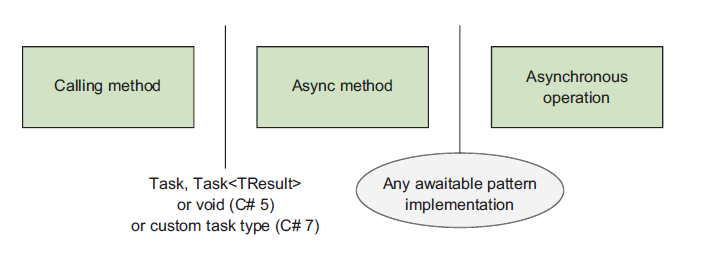

# CSharp In Depth (Asynchronous)

## 5 编写异步代码

本章将包含下面几个主题
- 编写异步代码意味着什么
- 使用 `async` 来声明异步方法
- 使用 `await` 操作符异步等待
- 自从 C# 5 以来语言的变化
- 异步代码遵循的使用规范

这几年来，异步已经成为开发者圈子中的拦路虎。总所周知，避免是在一个线程上苦苦等待一些任务完成是非常有效的，但是正确地实现它们却是非常困难地。

在 .NET Framework 中，我们已经三种模型来帮助我们处理异步地问题。

- .NET 1.x 中的 `BeginFoo/EndFoo` 方法采用 `IAsyncResult` 和 `AsyncCallback` 来传递结果
- .NET 2.0 中事件模型，比如 `BackgoundWorker` 和 `WebClient`
- .NET 4.0 中引入的 `Taks Parallel Libaray (TPL)`，并且在 .NET 4.5 中得到了拓展

尽管 TPL 设计非常棒，但是编写鲁棒性强，可读性高的异步代码却非常困难。虽然并行支持非常棒，但是通用的异步特色最好使在语言上，而不是仅仅依靠基础库。

C# 5 的主要特色在于在 TPL 上构建出来的 `async/await`。它允许你编写看上去同步，而实际上使在合适的地方进行异步的代码。没有了无穷无尽的回调，事件注册和零散的异常处理，而是在开发者已经相当熟悉的代码上表达出异步的意图。在 C# 5 中语言中允许你等待一个异步操作，这里的等待看上去像是阻塞操作，后面的代码将不会被执行直到这个操作完成。但是它的确做到了不阻塞当前的执行的线程，这个听上去匪夷所思，但是看完本章你就能明白其中的原理。

`async/await` 将会涉及较多的篇幅，但是我已经将 C# 6 和 C# 7 中包含的的功能单独列举出来，如果你又兴趣可以在下面的章节中关注它们。

在 .NET Framework 4.5 版本中全面的拥抱了异步编程，通过基于任务的编程模型使得不同 API 之间有一致性体验。同样的，在 Widnow Runtime 平台，也就是 Universal Windows Application 的基础中，对于长时间运行的程序强制使用异步机制。很多现代 API 也广泛使用异步，比如 Roslyn 和 HttpClient。总而言之，大部分 C# 开发者将会在它们最新的工作中使用异步。

要知道，C# 并不是无所不知，能够猜到哪些地方你需要进行同步或者异步操作。但是编译器是聪明的，但是它不会尝试将异步操作中的内在的复杂度移除掉。你作为开发者要仔细思考，但是 `async/awit` 的优美的地方在于消灭了冗长的，并且容易出错的面条式代码，这样你就可以专注于核心的地方。

一点警告，这部分话题可能有点超前，不幸的是也是非常重要的，但是在使用它们也是非常有套路的。

这一章将从一个正常的开发者的角度来了解异步，所以你可以使用 `async/await` 而不需要掌握更多的细节。第 6 章我们将会讨论实现的细节，这将会使非常困难的。我想你将会成为一个更好的开发者如果你能从背后了解其中的细节。但是在深入了解之前，通过本章的知识，你也能够游刃有余的处理异步问题。

### 5.1 介绍异步函数
到目前为止，我已经说过 C# 5 已经让异步变得简单多了，但是只不过使简单的描述，接下来我将通过一个例子来描述它。

C# 5 引入了异步函数的概念，它既可以是方法也可以是匿名函数，只需要加上 `async` 修饰符即可，那么它就可以使用 `await` 操作符来等待一个异步表达式。

异步表达式这个概念却有点意思：如果这个表达式表示的操作还没有完成，那么这个异步函数将立即返回，从它离开的地方继续往下执行直到这个值变得可用。正常的流程比如并不执行下面的语句直到这个异步的操作完成还是得到保证，只不过不阻塞调用的异步函数的过程，接下来我将通过具体的例子来足够拆解它们。

#### 5.1.1 初识异步

接下来我将通过一个生产实际中的例子来描述异步，我们常常讨厌网络延迟导致应用反应变慢，但是延迟就能很好的帮助我们理解为什么异步如此重要。尤其是你在使用 GUI 框架，比如 Windows Form. 我们第一个例子就是简单的 Windows Forms 引用程序，它拉取这本书的网站首页，然后标签中展示 HTML 页面的长度。

```C#
public class AsyncIntro : Form
{
    private static readonly HttpClient client = new HttpClient();
    private readonly Label lebel;
    private readonly Button button;

    public AsyncIntro()
    {
        label = new Label 
        {
            Location = new Point(10, 20),
            Text = "Length"
        };
        button = new Button 
        {
            Location = new Point(10, 50),
            Text = "Click"
        };
        button.Click += DisplayWebSiteLength();
        AutoSize = true;
        Controls.Add(label);
        Control.Add(button);
    }

    async void DisplayWebSiteLength(object sender, EventArgs e)
    {
        lable.Text = "Fetching...";
        string text = await client.GetStringAsync("http://csharpindepth.com");
        lable.Text = text.Length.ToString();
    }

    static void Main()
    {
        Application.Run(new AsyncIntro());
    }
}
```
这部分代码创建 UI 应用程序，然后为 Button 按钮注册了一个函数， 也就是 `DisplayWebSiteLength` 方法，这也是有趣的地方，当你点击这个按钮的时候，主页的内容就被拉取下来，然后标签上就会显示网页内容的长度。

我想可能可以使用控制台之类更简单的引用程序，但是我想这个 Demo 可以说明问题。特别要指出的是，如果你将 `async` 和 `await` 的关键字去掉，将 `HttpClient` 换成 `WebClient`，将 `GetStringAsync` 换成 `DownloadString`，那么代码同样也能编译通过和运行，但是在获取网页内容的时候，整个 UI 是被冻结的。如果你运行异步版本，你会发现 UI 是响应的，也就是说在拉取网页的时候，仍然可以移动窗口。

大部分开发者对于 Windows Form 开发都熟悉下面两个黄金定律：

- 不要在 UI 线程上运行耗时的操作
- 不同通过其他线程修改 UI 线程上的控件

你可能认为 Windows Form 已经是过时的技术，但是对于大部分 UI 框架都是遵循同样的规则，但是说起来容易做起来难。作为练习，你或许想通过不同的方式来实现上述的功能而不用 `async/await`。对于这种最简单的例子，使用基于事件的 `WebClient.DownloadStringAsync` 或许不是难事，但是对于更复杂的控制逻辑（错误处理，等待多个页面完成等等），使用这些方法就变得难以维护起来，而 C# 5 的代码修改起来更加自然一下。

此刻 `DisplayWebSiteLength` 方法看上去有点神奇，你或许知道你需要做什么，但是你不知道为什么是这样的，接下来我们将揭开他神秘的面纱。

#### 5.1.2 拆分第一个例子

接下来稍微修改一下刚刚的例子，在上述例子我直接使用 `await` 在 `HttpClient.GetStringAsync` 方法的返回值上，接下来将它们拆分开来。

```C#
async void DisplayWebSiteLength(object sender, EventArgs e)
{
    lebel.Text = "Fetching...";
    Task<string> task = client.GetStringAsync("http://csharpindepth.com");
    string text = await task;
    lebel.Text = text.Length.ToString();
}
```

注意一下，task 类型是 `Task<string>`, 但是 `await task` 表达式的类型却是 `string`。在这种情况下，`await` 操作符将扮演了拆封的角色，或者说当被 `await` 的值是 `Task<TResult>`。至少这一点看上去和异步没有关系但是使我们的工作变得轻松了。

`await` 主要目的是避免阻塞你要长时间等待的操作，你或许想知道这些工作究竟是哪个线程完成的。在这个方法的开头和结尾你都设置了 `lable.Text` 的内容，所以这些理应当在 UI 线程中执行，但是你也清楚地知道当你在等待网页下载的时候并没有阻塞 UI 线程。

魔法就在于这个方法在运行到 `await` 表达式的方法就返回了，然后它在同步地执行 UI 线程。如果你在第一行放置断点，然后进入 debug 模式，你可以看到这个按钮正在处于 Click 事件中，包含 Button.OnClick 方法。当你到达 `await` 方法，代码会检查结果是否可用，如果为否，它安排一个 continuation 来执行当网络操作完成之后的代码。在这个例子中，continuation 在 UI 线程中执行剩下的的代码，这也是为什么它能够操作 UI 的原因。

如果你在 `await` 表达式之后放置一个断点，并且再一次运行程序。假设 await 表达式会安排一个 continuation 来执行，那么你会看到调用栈中并没有 Button.OnClick 方法，这个方法在之前就完成过了。这个调用栈和如果你采用 Control.Invoke 方法使用后台线程更新 UI 是大致相同的，只不过这里自动帮你完成了。一开始你觉得关注调用栈是非常头疼的事，但是这些都是必要如果你想让异步变得高效。

编译器通过创建一个复杂的状态机来实现这个功能，实现的细节将会在下一章中给出，但是现在你只需要专注于 `async/await` 提供的功能。

### 5.2 思考异步

如果你请一个开发者描述异步执行，很大可能他会以多线程开始。尽管他是异步的典型用法，但是并不是一定的。为了完整的了解 C# 5 中的异步，我建议是彻底放弃之前关于线程的思考并且回到最基本的概念。

#### 5.2.1 异步执行的基础

同步占据了绝大部分 C# 开发者的熟悉的模型，考虑下面的简单的代码

```C#
Console.WriteLine("Frist");
Console.WriteLine("Second");
```

在第一行完成之后，第二行才开始，语句是按行执行。但是异步执行并不是按照这种方式，而都是 continuations 执行。当你开始执行某命令的时候，你告诉在这个操作完成之后将要执行什么。你或许听说过（或者用过）callback 的概念，但是那个有更宽泛的概念。在异步的语境中，这种 callback 是用来保存程序的状态而不是仅仅为了特殊的目的回调操作，比如 GUI 的事件 handler。

Continuation 在 .NET 中用委托的形式保存，它们通常是一个具体的接受异步操作返回值的的操作（Action）。这也是为什么在 C# 5 之前的的异步方法中的 `WebClient` ，你需要为不同的事件比如成功，失败或者其他定义好具体的处理代码。但是问题是为这些复杂的操作定义好这些委托将会非常困难，尽管我们可以使用 lambda 表达式。如果你想确保你的错误处理没有问题，那么情况将变得更加糟糕。

总之，所有的 `await` 语句要求编译器构建一个 continuation， 这种简明扼要地表达方式是的代码地可阅读性和开发者舒适性来看，都值得称赞。

我之前地描述地异步有点理想化了，实际上基于 Task 地异步模型都有点轻微地不同，并不是将一个 continuation 传递给异步操作，而是异步操作在开始地时候，将一个 token 返回给调用方，它能够提供所需要地 continuation。它代表了一个持续中地操作，也就是说它可能已经完成了或者说还在进行中。这个 token 非常有用，比如说我这边代码无法再进行下去，只有拿到这个操作地返回值。通常这个 Token 是 Task 或者是 Task<Result>, 但也不是必须的。

在 C# 5 中典型的异步执行流程如下

1. 做某些事情
2. 开始一个异步操作，并且记下返回的 token
3. 尽可能地再做其他一些工作
4. 等待异步操作完成
5. 做其他地事情
6. 完成

如果你不关心其中等待地部分，你可以在 C# 4 中做任何事情，但是如果你愿意等待直到异步地操作完成，那么 token 将会起重要地作用。对于 Task，你可以简单地调用 wait() 方法，此刻你在占据着重要地资源（线程）而并没有做任何有用地工作。就好像你电话定了一份pizza 外卖，但是一直站在门口等待快递小哥地到来。你真正想要的是做其他事情并且忽略 pizza 直到它到了，这时就是 await 发挥作用了。

当你等待一个异步操作，你好像再说:"我接下来尽可能地多做一些事情，直到这个操作完成”。如果你不想阻塞线程，你要怎么办？非常简单，只要在那边立即返回，让它自己异步执行。如果你想让调用者直到是否你的异步已经完成，只要返回一个 token 给调用者。

#### 5.2.2 同步上下文
之前我提到过，UI 代码地黄金准则是不允许跨线程更新用户界面，在之前地例子中，检查网页地长度是在异步中执行，所以你要确保 await 表达式之后地代码是在 UI 线程中执行。异步函数会通过 SynchronizationContext 回到正确地线程上执行，这个类从 .NET 2.0 就已经存在了，广泛使用在 BackgroundWorker 组件中。SynchronzationContext 可以将一个委托执行在正确的线程上，它的 Post (异步) 和 Send (同步) 消息和 Control.BeginInvoke 和 Control.Invoke 类似。

不同的执行环境使用不同的上下文，比如一个上下文可以让来自线程池中的线程执行给定的操作。 如果你对异步方法如何做到管理不同的执行情况，你可以关注 synchronziation 上下文。如果你是一个 ASP.NET 的开发者，特别要留心它的上下文，它经常让开发者陷入死锁状态。但是在 ASP.NET core 中，这种情况好多了。

有了这些基础理论，让我们近距离地看看异步方法种地细节，匿名异步函数和异步方法类似，但是异步方法看上去更容易理解。

#### 5.2.3 异步方法模型

下图是一个非常好的异步方法模型 


这里你有三个代码块，两个边界类型。作为简单地例子，在控制台版本地获取网页长度地应用程序，你地代码可能如下。

```C#
static readonly HttpClient client = new HttpClient();

static async Task<int> GetPageLengthAsync(string url)
{
    Task<string> featchTextTask = client.GetStringAsync(url);
    int lenght = (await fetchTextTask).Length;
    return length;
}

static void PrintPageLength()
{
    Task<int> lengthTask = 
        GetPageLengthAsync("http://csharpindepth.com");
    Console.WriteLine(lengthTask.Result);
}
```

下图展示了具体实例地细节对应上图地概念。


你感兴趣地是 `GetPageLengthAsync` 方法，但是我已经包含了 `PrintPageLength` 方法以便让你看看这些方法是怎么交互地。特别要注意地是，你一定要知道每个方法边界的地有效类型，在本章中我将会以不同步地形式重复展示这张示意图。

现在你想尝试写异步地方法看看它们究竟是如何工作地，但是如果详细展开那将涉及到很多内容。
这里只有两处语法不同，在声明一个异步方法的时候添加 `async` 和等待一个异步操作的时候的 `await`。下面三个小节将讨论异步方法的三个阶段。

- 使用 `async` 声明异步方法
- 使用 `await` 操作符等待一个异步操作
- 当操作完成时候的返回值

### 5.3 异步方法声明

异步方法声明和其他方法一样，只不过增加了一个 `async` 的关键字。它可以出现在返回值之前的任何位置，下面都是合法的形式：

```C#
public static async Task<int> FooAsync() {}
public async static Task<int> FooAsync() {}
async public Task<int> FooAsync() {}
public async virtual Task<int> FooAsycn() {}
```

我更倾向去将 `async` 紧靠着返回值之前，但是这个取决于个人的偏好，这个和你们团队的人讨论好这个问题。
现在 `async` 关键字好像有点神秘，语言的设计者其实没有必要添加一个 async 关键子，编译器只需要检查方法内部是否 `await` 关键字即可。但是我还是乐意让 `async` 是必须的，这样让读代码的时候就知道这是一个异步的方法，就像给你一个标识，让你关注其中的 await 语句。并且将阻塞的调用转变为异步地的调用。
实际上在生成的代码中，`async` 没有任何作用，只不过让调用者注意到这一点。这是一个兼容性的改变不管是源码还是二进制角度。实际上这个一个实现的细节，你不能在抽象方法和接口的方法中使用 `async`。但是更多的是在接口定义的时候使方法的返回值为 Task，不同的实现可以采用不同的方式，既可以使用 `async/await`，也可以使用常规的方法。

#### 5.3.1 异步方法的返回类型
调用者和异步方法之间的的通信是通过返回值完成的，在 C# 5 中，异步函数的返回值限定为以下三种
- void
- Task
- Task<TResult> (对于 TResult，我们叫做类型参数）

在 C# 7 中，这个列表中包含了 Task Types 类型，在 5.8 节和第六章中也可以看到。
在 .NET 4 中，Task 和 Task<TResult> 都表示还没有完成的操作。Task<TResult> 从 Task 中派生出来。两者的不同在于 Task 代表了操作返回的值的类型为 TResult. 然而 Task 并没有返回值，但是这个仍然是有效的，因为它提供了调用方和异步操作之间沟通的桥梁，用来判断它是否完成或者失败。在某些情况下可以将 Task 当作 T Task<void> 类型来使用，这样也是同样合法的。

设计返回值为 void 的主要原因是用来和事件处理相兼容，举个例子，你或许有也给 UI 按钮的单击的处理事件如下

```C#
private async void LoadStockPrice(object sender, EventArgs e)
{
    string ticker = ticketInput.Text;
    decimal price = await stockePriceService.FetchPriceAsync(ticket);
    priceDisplay.Text = price.ToString("c");
}
```

这是一个异步方法，但是调用代码（OnClick) 并不关心，它只需要知道处理的事件是否完成，只要你加载了股票价格并且更新 UI。实际上编译器将会为这段代码创建一个状态机，附上一个 continuation，当你在 FetchPriceAsync 方法完成后即可执行。
你也可以使用订阅的方式来创建指定事件的执行方法。

```C#
loadStockPriceButton.Click += LoadStockPrice;
```

尽管异步方法的返回值非常严格，但是其他的和正常方法一致，如果泛型，静态或者非静态，访问权限修饰符，不过在形参上有限制。

#### 5.3.2 异步方法的参数

异步方法中的任何参数都不允许使用 `out` 和 `ref` 修饰符。这样做是合理的，因为这些修饰符是用来和调用者之间沟通的，有些异步方法可能还没有执行就返回给调用者，这样引用形式的参数就有可能还没有设置。所以就有可能出现下面的状况，想象以下你将一个值通过 ref 传递给一个方法，异步方法可能是在调用异步操作之后才赋值，所以这样做是不合理的，所以编译器禁止这样做，同样指针类型也不允许这样做。

### 5.4 await 表达式

在方法声明中使用 `async` 标识符主要是为了使用 `await` 表达式。 除此之外，其余的和正常方法非常类似。你可以用任何控制流：循环，异常，using 语句或者其他任何事情。所以什么时候才可以使用 `await` 表达式，究竟怎么做？

`await` 表达式非常简单，仅仅使用 `await` 紧接着一个其他可以生成值的表达式。你可以等待一个函数调用的返回值，一个变量，一个属性。你也可以将一连串方法调用串起来，然后等待它们的结果。
```C#
int result = await foo.Bar().Baz(); 
```
最前面的 `await` 表达式的优先级比点（调用）操作还低，所以代码等同于下面的形式。

```C#
int result = await (foo.Bar().Baz());
```

但是使用是由限制的，这些表达式必须要可等待的，这样才可以使用这种模式。

#### 5.4.1 awaitable 模式

awaitable 模式就是用来决定哪些类型可以用在 `await` 操作符后面。

上图中第二个边界就是说明了异步方法如何与其他异步操作进行交互的。这个 awaitable 模式就是我们说的的异步操作。

你或许知道编译器通过检查是否实现 `IDisposable` 接口来判断该类是否可以使用在 using 语句中。想象以下如果你有一个类型为 T 的表达式想要等待，编译器会做如下检查。
- T 类型必须由一个无参数的 GetAwaiter() 的实例方法，或者一个扩展方法，接受一个类型参数 T。 这个方法的返回值必须要是非空，返回类型就叫做 awaiter type.
- awaiter type 应当实现了 System.Runtime.INotifyCompletion 接口，这个接口只有一个方法 void OnCompleted(Action)
- awaiter type 应当有一个可读的实例属性叫做 IsCompleted，并且返回类型为 bool.
- awaiter type 应当哟一个非泛型的无参数实例的方法，叫做 GetResult.
- 上面所说的不必要是 public的，只要你能够从异步方法中能够访问。

如果 T 通过检查，那么你就可以 await 一个类型为 T 的值。虽然编译器需要知道更多的信息，来决定你的 await 表达式的应该是什么是 GetResult 方法的返回值。在这个例子中使用的 void, 也就是说这个 await 表达式被认为是无结果的，就跟直接调用一个 void 方法一样。否则 await 表达式就被分类为生成和 GetResult 相同返回值的类型。
举个例子，让我们考虑以下 Task.Yield() 静态方法，不同于 Task 的其他方法，Yield() 方法并不返回任务本身，它返回一个 YieldAwaitable 类型。下面是简化的版本。
```C#
public class Task 
{
    public static YieldAwaitable Yield();
}

public struct YieldAwaitable
{
    public YieldAwaiter GetAwaiter();

    public struct YIeldAwaiter : INotifyCompletion
    {
        public bool IsCompleted {get;}
        public void OnCompleted(Action continuation);
        public void GetResult();
    }
}
```
你可以看到 YieldAwaitable 遵循上面的的描述，所以可以这样使用
```C#
public async Task ValidPrintYieldPrint()
{
    Console.WriteLine("before yielding");
    await Task.Yield();
    Console.WriteLine("after yielding");
}
```
但是下面的就不是合法的表达，因为它尝试从 YieldAwaitable 中获取结果

```C#
public async Task InvalidPrintYieldPrint()
{
    Console.WriteLine("before yielding");
    var result = await Task.Yield();
    Console.WriteLine("after yielding");
}
```
在 InvalidPrintYieldPrint 方法中的无效和下面的是同样的结果。

```C#
var result = Console.WriteLien("WrintLine is a void method");
```