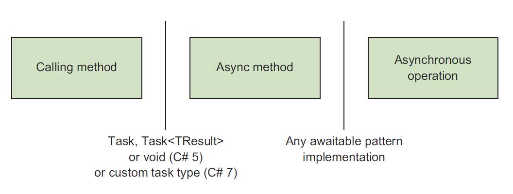
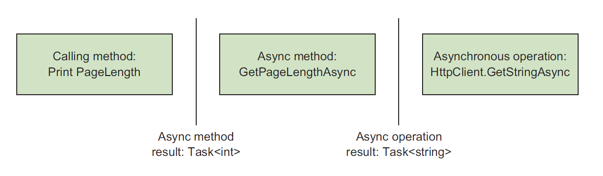
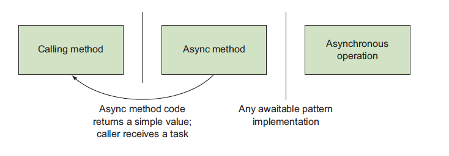
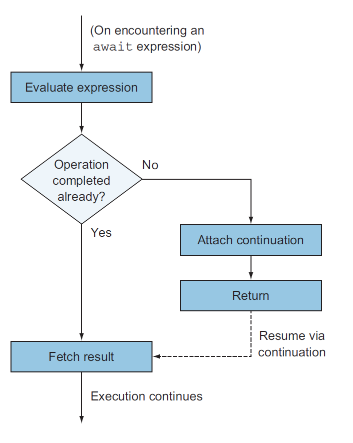
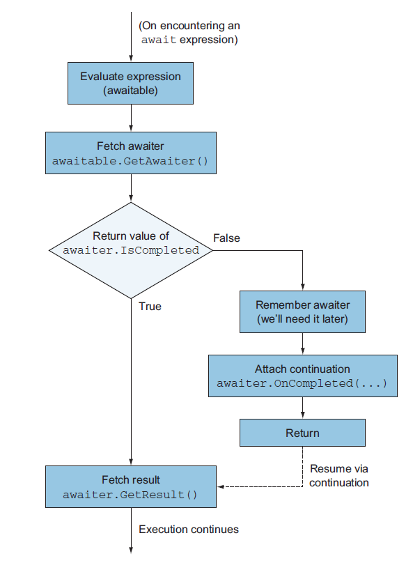
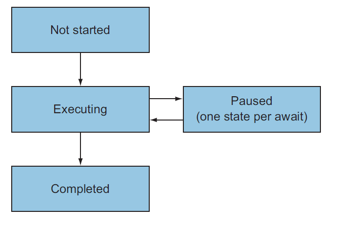

# CSharp In Depth (Asynchronous)

## 目录

- [5 编写异步代码](#5-%e7%bc%96%e5%86%99%e5%bc%82%e6%ad%a5%e4%bb%a3%e7%a0%81)
- [6 异步实现](#6-%e5%bc%82%e6%ad%a5%e5%ae%9e%e7%8e%b0)

## 5 编写异步代码

本章将包含下面几个主题
- 编写异步代码意味着什么
- 使用 `async` 来声明异步方法
- 使用 `await` 操作符异步等待
- 自从 `C# 5` 以来语言的变化
- 异步代码遵循的使用规范

这几年来，异步已经成为开发者圈子中的拦路虎。总所周知，避免是在一个线程上苦苦等待一些任务完成是非常有效的，但是正确地实现它们却是非常困难的。

在 .NET Framework 中，我们已经三种模型来帮助我们处理异步地问题。

- .NET 1.x 中的 `BeginFoo/EndFoo` 方法采用 `IAsyncResult` 和 `AsyncCallback` 来传递结果
- .NET 2.0 中事件模型，比如 `BackgoundWorker` 和 `WebClient`
- .NET 4.0 中引入的 `Taks Parallel Libaray (TPL)`，并且在 .NET 4.5 中得到了拓展

尽管 TPL 设计非常棒，但是编写鲁棒性强，可读性高的异步代码却非常困难。虽然并行支持非常棒，但是通用的异步特色最好使在语言上，而不是仅仅依靠基础库。

C# 5 的主要特色在于在 TPL 上构建出来的 `async/await`。它允许你编写看上去是同步，而实际上是在合适的地方进行异步的代码。没有了无穷无尽的回调，事件注册和零散的异常处理，而是在开发者已经相当熟悉的代码上表达出异步的意图。在 C# 5 中语言中允许你等待一个异步操作，这里的等待看上去像是阻塞操作，后面的代码将不会被执行直到这个操作完成。但是它的确做到了不阻塞当前的执行的线程，这个听上去匪夷所思，但是看完本章你就能明白其中的原理。

`async/await` 将会涉及较多的篇幅，但是我已经将 C# 6 和 C# 7 中包含的的功能单独列举出来，如果你有兴趣可以在下面的章节中关注它们。

在 .NET Framework 4.5 版本中全面的拥抱了异步编程，通过基于任务的编程模型使得不同 API 之间有一致性体验。同样的，在 Widnow Runtime 平台，也就是 Universal Windows Application 的基础中，对于长时间运行的程序强制使用异步机制。很多现代 API 也广泛使用异步，比如 Roslyn 和 HttpClient。总而言之，大部分 C# 开发者将会在它们最新的工作中使用异步。

要知道，C# 并不是无所不知，能够猜到哪些地方你需要进行同步或者异步操作。但是编译器是聪明的，但是它不会尝试将异步操作中的内在的复杂度移除掉。你作为开发者要仔细思考，但是 `async/awit` 的优美的地方在于消灭了冗长的，并且容易出错的面条式代码，这样你就可以专注于核心的地方。

警告一下，这部分话题可能有点超前，不幸的是也是非常重要的，但是在使用它们也是非常有套路的。

这一章将从一个正常的开发者的角度来了解异步，所以你可以使用 `async/await` 而不需要掌握更多的细节。第 6 章我们将会讨论实现的细节，这将会使非常困难的。我想你将会成为一个更好的开发者如果你能从背后了解其中的细节。但是在深入了解之前，通过本章的知识，你也能够游刃有余的处理异步问题。

### 5.1 介绍异步函数
到目前为止，我已经说过 C# 5 已经让异步变得简单多了，但是只不过使简单的描述，接下来我将通过一个例子来描述它。

C# 5 引入了异步函数的概念，它既可以是方法也可以是匿名函数，只需要加上 `async` 修饰符即可，那么它就可以使用 `await` 操作符来等待一个异步表达式。

异步表达式这个概念却有点意思：如果这个表达式表示的操作还没有完成，那么这个异步函数将立即返回，从它离开的地方继续往下执行直到这个值变得可用。正常的流程比如并不执行下面的语句直到这个异步的操作完成还是得到保证，只不过不阻塞调用的异步函数的过程，接下来我将通过具体的例子来足够拆解它们。

#### 5.1.1 初识异步

接下来我将通过一个生产实际中的例子来描述异步，我们常常讨厌网络延迟导致应用反应变慢，但是延迟就能很好的帮助我们理解为什么异步如此重要。尤其是你在使用 GUI 框架，比如 Windows Form. 我们第一个例子就是简单的 Windows Forms 引用程序，它拉取这本书的网站首页，然后标签中展示 HTML 页面的长度。

```C#
public class AsyncIntro : Form
{
    private static readonly HttpClient client = new HttpClient();
    private readonly Label lebel;
    private readonly Button button;

    public AsyncIntro()
    {
        label = new Label 
        {
            Location = new Point(10, 20),
            Text = "Length"
        };
        button = new Button 
        {
            Location = new Point(10, 50),
            Text = "Click"
        };
        button.Click += DisplayWebSiteLength();
        AutoSize = true;
        Controls.Add(label);
        Control.Add(button);
    }

    async void DisplayWebSiteLength(object sender, EventArgs e)
    {
        lable.Text = "Fetching...";
        string text = await client.GetStringAsync("http://csharpindepth.com");
        lable.Text = text.Length.ToString();
    }

    static void Main()
    {
        Application.Run(new AsyncIntro());
    }
}
```
这部分代码创建 UI 应用程序，然后为 Button 按钮注册了一个函数， 也就是 `DisplayWebSiteLength` 方法，这也是有趣的地方，当你点击这个按钮的时候，主页的内容就被拉取下来，然后标签上就会显示网页内容的长度。

我想可能可以使用控制台之类更简单的引用程序，但是我想这个 Demo 可以说明问题。特别要指出的是，如果你将 `async` 和 `await` 的关键字去掉，将 `HttpClient` 换成 `WebClient`，将 `GetStringAsync` 换成 `DownloadString`，那么代码同样也能编译通过和运行，但是在获取网页内容的时候，整个 UI 是被冻结的。如果你运行异步版本，你会发现 UI 是响应的，也就是说在拉取网页的时候，仍然可以移动窗口。

大部分开发者对于 Windows Form 开发都熟悉下面两个黄金定律：

- 不要在 UI 线程上运行耗时的操作
- 不同通过其他线程修改 UI 线程上的控件

你可能认为 Windows Form 已经是过时的技术，但是对于大部分 UI 框架都是遵循同样的规则，但是说起来容易做起来难。作为练习，你或许想通过不同的方式来实现上述的功能而不用 `async/await`。对于这种最简单的例子，使用基于事件的 `WebClient.DownloadStringAsync` 或许不是难事，但是对于更复杂的控制逻辑（错误处理，等待多个页面完成等等），使用这些方法就变得难以维护起来，而 C# 5 的代码修改起来更加自然一下。

此刻 `DisplayWebSiteLength` 方法看上去有点神奇，你或许知道你需要做什么，但是你不知道为什么是这样的，接下来我们将揭开他神秘的面纱。

#### 5.1.2 拆分第一个例子

接下来稍微修改一下刚刚的例子，在上述例子我直接使用 `await` 在 `HttpClient.GetStringAsync` 方法的返回值上，接下来将它们拆分开来。

```C#
async void DisplayWebSiteLength(object sender, EventArgs e)
{
    lebel.Text = "Fetching...";
    Task<string> task = client.GetStringAsync("http://csharpindepth.com");
    string text = await task;
    lebel.Text = text.Length.ToString();
}
```

注意一下，task 类型是 `Task<string>`, 但是 `await task` 表达式的类型却是 `string`。在这种情况下，`await` 操作符将扮演了拆封的角色，或者说当被 `await` 的值是 `Task<TResult>`，至少这一点看上去和异步没有关系但是使我们的工作变得轻松了。

`await` 主要目的是避免阻塞你要长时间等待的操作，你或许想知道这些工作究竟是哪个线程完成的。在这个方法的开头和结尾你都设置了 `lable.Text` 的内容，所以这些理应当在 UI 线程中执行，但是你也清楚地知道当你在等待网页下载的时候并没有阻塞 UI 线程。

魔法就在于这个方法在运行到 `await` 表达式的方法就返回了，然后它在同步地执行 UI 线程。如果你在第一行放置断点，然后进入 debug 模式，你可以看到这个按钮正在处于 Click 事件中，包含在 Button.OnClick 方法。当你到达 `await` 方法，代码会检查结果是否可用，如果为否，它安排一个 continuation 来执行当网络操作完成之后的代码。在这个例子中，continuation 在 UI 线程中执行剩下的的代码，这也是为什么它能够操作 UI 的原因。

如果你在 `await` 表达式之后放置一个断点，并且再一次运行程序。假设 `await` 表达式会安排一个 continuation 来执行，那么你会看到调用栈中并没有 Button.OnClick 方法，这个方法在之前就完成过了。这个调用栈和你采用 Control.Invoke 方法使用后台线程更新 UI 是大致相同的，只不过这里自动帮你完成了。一开始你觉得关注调用栈是非常头疼的事，但是这些都是必要如果你想让异步变得高效。

编译器通过创建一个复杂的状态机来实现这个功能，实现的细节将会在下一章中给出，但是现在你只需要专注于 `async/await` 提供的功能。

### 5.2 思考异步

如果你请一个开发者描述异步执行，很大可能他会以多线程开始。尽管它是异步的典型用法，但是并不是一定的。为了完整的了解 C# 5 中的异步，我建议是彻底放弃之前关于线程的思考并且回到最基本的概念。

#### 5.2.1 异步执行的基础

同步占据了绝大部分 C# 开发者的熟悉的模型，考虑下面的简单的代码

```C#
Console.WriteLine("Frist");
Console.WriteLine("Second");
```

在第一行完成之后，第二行才开始，语句是按行执行。但是异步执行并不是按照这种方式，而都是 continuations 执行。当你开始执行某命令的时候，你告诉在这个操作完成之后将要执行什么。你或许听说过（或者用过）callback 的概念，但是那个有更宽泛的概念。在异步的语境中，这种 callback 是用来保存程序的状态而不是仅仅为了特殊的目的回调操作，比如 GUI 的事件 handler。

Continuation 在 .NET 中用委托的形式保存，它们通常是一个具体的接受异步操作返回值的的操作（Action）。这也是为什么在 C# 5 之前的的异步方法中的 `WebClient` ，你需要为不同的事件比如成功，失败或者其他定义好具体的处理代码。但是问题是为这些复杂的操作定义好这些委托将会非常困难，尽管我们可以使用 lambda 表达式。如果你想确保你的错误处理没有问题，那么情况将变得更加糟糕。

总之，所有的 `await` 语句要求编译器构建一个 continuation， 这种简明扼要地表达方式是的代码地可阅读性和开发者舒适性来看，都值得称赞。

我之前地描述地异步有点理想化了，实际上基于 Task 地异步模型都有点轻微地不同，并不是将一个 continuation 传递给异步操作，而是异步操作在开始地时候，将一个 token 返回给调用方，它能够提供所需要地 continuation。它代表了一个持续中地操作，也就是说它可能已经完成了或者说还在进行中。这个 token 非常有用，比如说我这边代码无法再进行下去，只有拿到这个操作地返回值。通常这个 token 是 `Task` 或者是 `Task<TResult>`, 但也不是必须的。

在 C# 5 中典型的异步执行流程如下

1. 做某些事情
2. 开始一个异步操作，并且记下返回的 token
3. 尽可能地再做其他一些工作
4. 等待异步操作完成
5. 做其他地事情
6. 完成

如果你不关心其中等待的部分，你可以在 C# 4 中做任何事情，但是如果你愿意等待直到异步地操作完成，那么 token 将会起重要地作用。对于 Task，你可以简单地调用 wait() 方法，此刻你在占据着重要地资源（线程）而并没有做任何有用地工作。就好像你电话定了一份pizza 外卖，但是一直站在门口等待快递小哥地到来。你真正想要的是做其他事情并且忽略 pizza 直到它到了，这时就是 await 发挥作用了。

当你等待一个异步操作，你好像在说 "我接下来尽可能地多做一些事情，直到这个操作完成”。如果你不想阻塞线程，你要怎么办？非常简单，只要在那边立即返回，让它自己异步执行。如果你想让调用者直到是否你的异步已经完成，只要返回一个 token 给调用者。

#### 5.2.2 同步上下文
之前我提到过，UI 代码地黄金准则是不允许跨线程更新用户界面，在之前地例子中，检查网页地长度是在异步中执行，所以你要确保 await 表达式之后地代码是在 UI 线程中执行。异步函数会通过 SynchronizationContext 回到正确地线程上执行，这个类从 .NET 2.0 就已经存在了，广泛使用在 BackgroundWorker 组件中。SynchronzationContext 可以将一个委托执行在正确的线程上，它的 Post (异步) 和 Send (同步) 消息和 Control.BeginInvoke 和 Control.Invoke 类似。

不同的执行环境使用不同的上下文，比如一个上下文可以让来自线程池中的线程执行给定的操作。 如果你对异步方法如何做到管理不同的执行情况，你可以关注 synchronziation 上下文。如果你是一个 ASP.NET 的开发者，特别要留心它的上下文，它经常让开发者陷入死锁状态。但是在 ASP.NET Core 中，这种情况好多了。

有了这些基础理论，让我们近距离地看看异步方法种地细节，匿名异步函数和异步方法类似，但是异步方法看上去更容易理解。

#### 5.2.3 异步方法模型

下图是一个非常好的异步方法模型 



这里你有三个代码块，两个边界类型。作为简单地例子，在控制台版本地获取网页长度地应用程序，你的代码可能如下：

```C#
static readonly HttpClient client = new HttpClient();

static async Task<int> GetPageLengthAsync(string url)
{
    Task<string> featchTextTask = client.GetStringAsync(url);
    int lenght = (await fetchTextTask).Length;
    return length;
}

static void PrintPageLength()
{
    Task<int> lengthTask = 
        GetPageLengthAsync("http://csharpindepth.com");
    Console.WriteLine(lengthTask.Result);
}
```

下图展示了具体实例地细节对应上图地概念。



你感兴趣的是 `GetPageLengthAsync` 方法，但是我已经包含了 `PrintPageLength` 方法以便让你看看这些方法是怎么交互的。特别要注意的是，你一定要知道每个方法的边界的有效类型，在本章中我将会以不同步地形式重复展示这张示意图。

现在你想尝试写异步地方法看看它们究竟是如何工作的，但是如果详细展开那将涉及到很多内容。
这里只有两处语法不同，在声明一个异步方法的时候添加 `async` 和等待一个异步操作的时候的 `await`。下面三个小节将讨论异步方法的三个阶段。

- 使用 `async` 声明异步方法
- 使用 `await` 操作符等待一个异步操作
- 当操作完成时候的返回值

### 5.3 异步方法声明

异步方法声明和其他方法一样，只不过增加了一个 `async` 的关键字。它可以出现在返回值之前的任何位置，下面都是合法的形式：

```C#
public static async Task<int> FooAsync() {}
public async static Task<int> FooAsync() {}
async public Task<int> FooAsync() {}
public async virtual Task<int> FooAsycn() {}
```

我更倾向去将 `async` 紧靠着返回值之前，但是这个取决于个人的偏好，这个和你们团队的人讨论好这个问题。
现在 `async` 关键字好像有点神秘，语言的设计者其实没有必要添加一个 async 关键子，编译器只需要检查方法内部是否 `await` 关键字即可。但是我还是乐意让 `async` 是必须的，这样让读代码的时候就知道这是一个异步的方法，就像给你一个标识，让你关注其中的 `await` 语句。并且将阻塞的调用转变为异步地的调用。

实际上在生成的代码中，`async` 没有任何作用，只不过让调用者注意到这一点。这是一个兼容性的改变不管是源码还是二进制角度。实际上这个一个实现的细节，你不能在抽象方法和接口的方法中使用 `async`。但是更多的是在接口定义的时候使方法的返回值为 Task，不同的实现可以采用不同的方式，既可以使用 `async/await`，也可以使用常规的方法。

#### 5.3.1 异步方法的返回类型

调用者和异步方法之间的的通信是通过返回值完成的，在 C# 5 中，异步函数的返回值限定为以下三种
- `void`
- `Task`
- `Task<TResult>` (对于 TResult，我们叫做类型参数）

在 C# 7 中，这个列表中包含了 Task Types 类型，在 5.8 节和第六章中也可以看到。
在 .NET 4 中，`Task` 和 `Task<TResult>` 都表示还没有完成的操作。`Task<TResult>` 从 `Task` 中派生出来。两者的不同在于 `Task` 代表了操作返回的值的类型为 TResult. 然而 `Task` 并没有返回值，但是这个仍然是有效的，因为它提供了调用方和异步操作之间沟通的桥梁，用来判断它是否完成或者失败。在某些情况下可以将 `Task` 当作 `Task<void>` 类型来使用，这样也是同样合法的。

设计返回值为 void 的主要原因是用来和事件处理相兼容，举个例子，你或许有也给 UI 按钮的单击的处理事件如下

```C#
private async void LoadStockPrice(object sender, EventArgs e)
{
    string ticker = ticketInput.Text;
    decimal price = await stockePriceService.FetchPriceAsync(ticket);
    priceDisplay.Text = price.ToString("c");
}
```

这是一个异步方法，但是对于调用代码（OnClick） 并不关心，它只需要知道处理的事件是否完成，只要你加载了股票价格并且更新 UI。实际上编译器将会为这段代码创建一个状态机，附上一个 continuation，当你在 FetchPriceAsync 方法完成后立即执行。
你也可以使用订阅的方式来创建指定事件的执行方法。

```C#
loadStockPriceButton.Click += LoadStockPrice;
```

尽管异步方法的返回值非常严格，但是其他的和正常方法一致，如果泛型，静态或者非静态，访问权限修饰符，不过在形参上有限制。

#### 5.3.2 异步方法的参数

异步方法中的任何参数都不允许使用 `out` 和 `ref` 修饰符。这样做是合理的，因为这些修饰符是用来和调用者之间沟通的，有些异步方法可能还没有执行就返回给调用者，这样引用形式的参数就有可能还没有赋值。可能出现下面的状况，想象一下你将一个值通过 ref 传递给一个方法，异步方法可能是在调用异步操作之后才赋值，所以这样做是不合理的，所以编译器禁止这样做，同样指针类型也不允许这样做。

### 5.4 await 表达式

在方法声明中使用 `async` 标识符主要是为了使用 `await` 表达式。 除此之外，其余的和正常方法非常类似。你可以用任何控制流：循环，异常，using 语句或者其他任何事情。所以什么时候才可以使用 `await` 表达式，究竟怎么做？

`await` 表达式非常简单，仅仅使用 `await` 紧接着一个其他可以生成值的表达式。你可以等待一个函数调用的返回值，一个变量，一个属性。你也可以将一连串方法调用串起来，然后等待它们的结果。
```C#
int result = await foo.Bar().Baz(); 
```
最前面的 `await` 表达式的优先级比点（调用）操作还低，所以代码等同于下面的形式。

```C#
int result = await (foo.Bar().Baz());
```

但是使用是有限制的，这些表达式必须要可等待的，这样才可以使用这种模式。

#### 5.4.1 awaitable 模式

awaitable 模式就是用来决定哪些类型可以用在 `await` 操作符后面。


上图中第二个边界就是说明了异步方法如何与其他异步操作进行交互的。这个 awaitable 模式就是我们说的的异步操作。

你或许知道编译器通过检查是否实现 `IDisposable` 接口来判断该类是否可以使用在 using 语句中。想象以下如果你有一个类型为 T 的表达式想要等待，编译器会做如下检查。
- T 类型必须由一个无参数的 GetAwaiter() 的实例方法，或者它接受一个类型参数 T 的扩展方法。 这个方法的返回值必须要是非空，返回类型就叫做 awaiter type.
- awaiter 类型应当实现了 System.Runtime.INotifyCompletion 接口，这个接口只有一个方法 void OnCompleted(Action)
- awaiter 类型应当有一个可读的实例属性叫做 IsCompleted，并且返回类型为 bool.
- awaiter 类型应当有一个非泛型的无参数实例的方法，叫做 GetResult.
- 上面所说的不必要是 public的，只要你能够从异步方法中能够访问。

如果 T 通过检查，那么你就可以 await 一个类型为 T 的值。虽然编译器需要知道更多的信息，来决定你的 await 表达式的应该是什么 GetResult 方法的返回值。在这个例子中使用的 void, 也就是说这个 await 表达式被认为是无结果的，就跟直接调用一个 void 方法一样。否则 await 表达式就被分类为生成和 GetResult 相同返回值的类型。
举个例子，让我们考虑以下 Task.Yield() 静态方法，不同于 Task 的其他方法，Yield() 方法并不返回任务本身，它返回一个 YieldAwaitable 类型。下面是简化的版本。
```C#
public class Task 
{
    public static YieldAwaitable Yield();
}

public struct YieldAwaitable
{
    public YieldAwaiter GetAwaiter();

    public struct YIeldAwaiter : INotifyCompletion
    {
        public bool IsCompleted {get;}
        public void OnCompleted(Action continuation);
        public void GetResult();
    }
}
```
你可以看到 YieldAwaitable 遵守上面的的描述规定，所以可以这样使用
```C#
public async Task ValidPrintYieldPrint()
{
    Console.WriteLine("before yielding");
    await Task.Yield();
    Console.WriteLine("after yielding");
}
```
但是下面的就不是合法的表达，因为它尝试从 YieldAwaitable 中获取结果

```C#
public async Task InvalidPrintYieldPrint()
{
    Console.WriteLine("before yielding");
    var result = await Task.Yield();
    Console.WriteLine("after yielding");
}
```
在 InvalidPrintYieldPrint 方法中的无效和下面的是同样的结果。

```C#
var result = Console.WriteLine("WrintLine is a void method");
```
因为没有返回值，所以不能将它赋值给一个变量。所以 Task 类型有一个返回值为空的 `GetResult` 方法，而 `Task<TResult>` 类型有一个返回值为 TResult 的 GetResult 方法。

在 5.6 节中更多详细的细节来描述 awaitable 模式。 所以你在考虑异步方法的时候，你并不只是完成了 await 表达式，还有更多的其他细节。

#### 5.4.2 await 表达式的限制

和 yield return 一样，规则限制你使用 await 表达式场景，最显著的特点就是它只能使用在 aysnc 描述的方法和表达式中。甚至在 async 方法中不能再匿名方法中使用 await 语句，除了这个匿名方法也是异步的。

await 语句不能使用在不安全的上下文中，但是这并不意味着异步方法中不能使用不安全上下文，下面的例子说明了这种情况：

```C#
static async Task DelayWithResultOfUnsafeCode(string text)
{
    int total = 0;
    unsafe 
    {
        fixed(char* textPointer = text)
        {
            char *p = textPointer;
            while(*p!=0)
            {
                total += *p;
                p++;
            }
        }
    }
    Console.WriteLine("Deplaying for " + total + "ms");
    await Task.Delay(total);
    Console.WriteLine("Deplay complted");
}
```

所以你不能在 lock 语句中使用 await，如果你发现在等待异步操作完成的时候还拥有一把锁，那么你要重新考虑以下你的代码。也不要尝试使用 Monitor.TryEnter 或者是 Montir.Exit 这样的方法。改变你的代码，以便它不需要 lock 也能工作。如果实在需要，考虑使用 SemaphoreSlim, 并且使用 WaitAsync 方法。

因为获取锁和释放锁必须要是同一个线程，但是在异步中，await 语句之后可能并不是同一个线程中。虽然 GUI 应用程序可以做到这一点，但是其他应用程序并不是在异步方法开始和结束都在同一个线程。基本上来讲，lock 语句和异步并不能很好的相处。

下面是一些使用场景，在 C# 5 中无效，但是在 C# 6 中有效。
- 任何 try 和 catch 语句块
- catch 语句块
- finally 语句块

在 try 语句只用 finally 语句中，使用 await 是没有问题的，也就是说在 using  语句中使用也是没问题的。 C# 设计并者没有弄清楚在 C# 5 发布之前，await 在上述的上下文中是否安全。但是在 C# 6 中，他们弄清楚了如何在上述情况中构建出正确的状态机。

现在你知道了如何声明一个异步方法，如何使用 await 表达式。但是在你已经完成异步工作后发生了什么，让我们来看看值是如何返回给调用代码的。

### 5.5 封装返回值

我们已经知道如何声明调用方法和异步方法之间的界限，也知道了如何在一个异步方法中等待一个异步操作。



接下来看看返回语句是如何实现第一个边界，即返回值到代码调用处。

你已经看过带返回值的例子，接下来仔细看看返回值这一块。

```C#
static async Task<int> GetPageLengthAsync(string url)
{
    Task<string> fetchTextTask = client.GetStringAsync(url);
    int length = (await fetchTextTask).Length;
    return length;
}
```

我们可以看到，length 的类型是 int， 但是方法的返回值是 `Task<int>`。编译器生成的代码会仔细封装它。所以调用者得到的一个 `Task<int>`， 它将包含了当异步完成后的值。如果非泛型的 Task 作为一个返回值，就跟 void 一样。它不需要返回语句，而且所有的返回语句只是简单的 return, 而不是其他形式。在任何一种情况下，task 都能够将异常从异步方法中抛出来。

希望到目前为止，我希望你有个良好的直觉就是封装这一层非常由必要，一个方法应当在到达返回语句的时候，给调用者返回特定的东西。并且在将来把结果以某种形式传递给调用者。`Task<Result>` 就像承诺一样，异常也是同样如此。

一个正常的执行流程是这样的，如果返回语句是在 try 语句中被执行，并且包含相应的 finally 语句，return 后面的语句会立即执行，但是它不会是 Task 的结果直到所有的资源清理干净，所以如果在 finally 中抛出的了异常，你并不会得到一个既是成功又是失败的结果，而是一个失败的结果。

正如我之前所说的，自动封装和拆封能够让异步操作组合非常方便，异步方法可以很容易的处理异步方法的结果。你可以通过这个构建也给负载的系统。就跟 Linq 一样。在异步世界中，很少由直接显示的处理 task，而是使用 await 来使用它。从 task 中自动获取结果是作为异步方法的机制。现在你已经直到异步方法长什么样，所以更容易向你证明异步的执行流程。


### 5.6 异步方法流

你可以从不同的层次思考 async/await 
- 你可以简单的期待 await 操作做了哪些事情
- 你直到代码是如何执行的，换句话说就是在什么时候，什么东西在那个线程上执行了，并不知道它是如何实现的。
- 你知道它的基础架构，为什么会这样执行。

到目前为止，我们大部分考虑的是在第一个层次，偶尔深入到第二个层次。这一节我们将专注于第二个层次，主要看看从语言层面保证了什么。我们将第三个层次下一个章节中，在那里你将看到编译器在做了什么。

大部分情况下，你不过在是编写代码，所以掌握前两层次并没有大的问题。除非我在写大量的操作来安排它们，我很少考虑到第二个层次的细节。大部分时候，我们只需要让它跑起来。但是重要的是你要知道为什么是这样的。

#### 5.6.1 在等待什么等多久。

首先简单一点，有时候 await 用来调用方法链的结果或者是属性，比如说：

```C#
string pageText = await new HttpClient().GetStringAsync();
```
看上去 await 可以修改整个表达式的意义，实际上，await 只能作用于单个值。之前的表达式等同于下面：

```C#
Task<string> task = new HttpClient().GetStringAsync();
string pageText = await task;
```

同样的，await 表达式也可以用在方法的参数中或者其他表达式。如果你有两个方法,分别为 GetHourlyRateAsync() 和 GetHoursWorkedAsync()，分别返回 Task<decimal> 和 Task<int>，你可以有下面这个负载的语句

```C#
AddPayment(await emploee.GetHourlyRateAsync() * 
           await timeSheet.GetHoursWorkedAsync(employee.Id));
```

和正常的 C# 表达式计算一样，乘号右边的表达式必须在左边的执行完毕之后才能继续执行。所以前面的表达式可以等效于下面的

```C#
Task<decimal> hourlyRateTask = employee.GetHourlyRateAsync();
decimal hourlyRate = await hourlyRateTask;
Task<int> hoursWorkedTask = timeSheet.GetHoursWorkedAsync(employee.Id);
int hoursWorked = await hoursWorkedTask;
AddPayment(hourlyRate * hoursWorked)
```

怎么写代码是有点区分，如果你觉得单个语句更容易阅读，没问题；如果你将他们都展开，你也许有更多的代码，但是更容易理解和调试。你也可以使用第三种方法，但是这一种方法将产生不同的效果

```C#
Task<decimal> hourlyRateTask = employee.GetHourlyRateAsync();
Task<int> hoursWorkedTask = timeSheet.GetHoursWorkedAsync(employee.Id);
AddPayment(await hourlyRateTask * await hoursWorkedTask);
```

我认为这一种更加容易阅读，而且性能上更加优越。这一节最重要的是要弄清楚他在等待什么，什么时候开始等待。在这种情况下，从 GetHourlyRateAsync 和 GetHoursWorkedAsync 返回的任务被等待。在每种情况下，在调用 AddPayment 方法之前，都要等待这些结果。这样是合理的，你需要得到两者的结果的成绩作为参数传递给 AddPayment. 如果使用同步，一切都显而易见的。现在已经知道如何简化要等待的值的代码，现在你需要知道在等待的时候发生了什么。

#### 5.6.2 执行等待表达式

执行过程中到达 await 表达式，有两种可能情况，一种是异步操作已经完成，另一种是没有完成。如果操作已经完成了，事情就好办了，执行流继续进行下去。如果操作失败并且捕获了一个异常，异常就会被抛出。否则操作的返回的结果就被解析，比如将 string 类型的结果从 `Task<string>` 中解析出来。所有的这一切都没有线程上下文切换，或者附上一个 continnuation。

但是更有趣的场景是，异步操作还在进行中。在这种情况下，这个方法将会等待异步操作的完成，然后在合适的上下文继续执行下去。异步的等待意味着这个方法并没有执行，一个 continuation 将会附给这个异步操作，然后方法返回了。异步的基础设施能够保证整个 continuation 能够在正确的线程上执行。通常是线程池线程，或者是 UI 线程。这个取决于 synchronization 上下文。通过 Task.ConfigurationAwait 也可以控制它们的行为。

从开发者的角度来看，就像这个方法被暂停了直到异步操作完成。编译器能够保证所有的方法中的局部变量都能拥有在 continuation 创建之前一样的值。就跟 yield return 语句中的一样。

让我们看看控制台的简单的应用程序，它使用单个异步方法等待两个任务，Task.FromResult 通常返回一个完成的任务，而 Task.Deploy 在等待特定的时间后返回。

```C#
static void Main()
{
    Task task = DemoCompletedAsync();
    Console.WriteLine("Method returned");
    task.Wait();
    Console.WriteLine("Task Completed");
}

static async Task DemoCompletedASync()
{
    Console.WriteLine("Before first wait");
    await Task.FromResult(10);
    Console.WriteLine("Between awaits");
    await Task.Delay(1000);
    Console.WriteLine("After second await");
}
```
输出如下

```
Before first await
Between awaits
Method returned
After second await
Task completed
```

从中我们可以得到

- 异步方法并不等待已经完成任务，方法仍然按照同步的方法执行。这也是为什么你在头两行中看不到其他的。
- 异步方法只有在延迟的任务中返回，这也是为什么第三行中的 Method returned 在 Main 方法中输出。异步方法可以表明异步的操作还没有未完成，而是选择返回。
- 异步方法只有在异步操作完成后才返回，这也是为什么 Task Completed 在 After second await 之后输出。



上图表明了 await 表达式执行流。你可以认为虚线部分作为另一个分支。 注意我假设 await 表达式的是有结果的。 如果你在等待一个普通的 Task 或者其他相似的形式。fetch result 可以意味着用来检查操作是否成功完成。
请仔细思考一下从一个异步方法返回意味着什么，两种可能：
- 这是第一个 await 表达式需要等待，所以你还有原先的方法的调用栈
- 你已经等待过还没有完成的任务。所以你现在在一个 continuation 中被其他调用。你的调用栈和进入这个方法的时候完全不同了。

在第一种情况下，你通常以 `Task` 或者 `Task<TResult>` 返回给调用者。显然你还没有方法的结果，你甚至不知道方法是否完成，所以你的方法将会作为一个未完成的任务。

在后一种情况中，调用你 continuation 的取决于你的上下文。举个例子来讲，在 window form UI 中，如果你通过 UI 线程中启动一个异步方法，而且不刻意切换走，那么整个方法将会在UI线程中。在方法的前半部分，你将会在 event handler 或者其他任何启动异步方法中执行。后面部分，你将会被 Windows Forms 内部机制直接调用。正如你使用 Control.BeginInvoek(continuation) 一样。在调用代码中，无论是 Windows From 消息队列或者线程池中部分，并不关心你的任务。

提醒一下，直到到达 await 表达式，整个方法的执行都是同步地。调用异步方法并不是简单地在单独线程其中启动新的任务。这个取决于你确保你编写的异步方法能够快速地返回。需要承认的是，这个取决于你写代码的上下文，一般来讲，你需要避免在异步方法中执行长时间运行的工作。将它迁移到其他方法中并且为它创建一个 Task。

我想在简单回顾一下当你的等待的操作已经完成了的情况，你可能想知道为什么已经完成的操作首先会被看作异步。就好像在 Linq 中调用 Count 方法，通常情况下，你或许要迭代序列中的每个元素，但是在某些情况下，比如 List<T>, 有更优化的方法。使用单个抽象来满足大部分场景是有用的，但是不需要付执行时间的成本。

现实世界中的异步 API 例子，考虑异步地从文件或者磁盘流中读取数据，如果如果所有的数据都已经从磁盘读到内存中，获取在之前地 ReadAsync 调用中，应该直接返回而不是通过异步地方式。另一个例子就是架构中地缓存，如果你想从内存缓存，或者其他地方读取对于异步操作都是透明的。既然你已经知道基本的操作流，现在你知道如何将他们 await 模式拼装起来。

#### 5.6.3 异步模式的使用

在之前小节中，我描述了异步模式中需要完成的返回类型需要满足的要求，下图是之前的一个更加通用的描述。


写到这里，你可能想知道这些细节都是关于什么的，为什么语言要支持这些。 附属一个 continuation 比想象中的还要复杂。在简单情况下，当整个控制逻辑都是线性的，continuation 就像一个 lambda 表达式一样。但是如果表达式包含了循环或者判断条件，这样问题就变得负载起来，这也就是为什么 async/await 的作用。尽管你可以认为编译器仅仅提供了一个语法糖而已，但是在提供可读性这一块还是有这巨大的提升。

到目前为止，我们仅仅讨论了正确的执行结果，但是如果失败了怎么办？

#### 4.6.4 异常拆封

对于 .NET 而言，使用异常表示失败。就跟返回值给调用者一样，异常处理需要语言的支持。当你等待的异步操作失败了，或许它已经在另外一个线程里已经发生了好久。正常的异常传递在这里不起作用了。在这里 async/await 尝试将处理异步异常的体验尽可能地和同步模式相类似。如果你认为失败是另外一种结果，那么异常和返回值处理是类似的。在下一小节中，你将看到异常是如何向异步方法外传递的，但是目前先要看一下异步操作中发生异常会怎样。

GetResult 方法意味着从返回值中取结果，它同样肩负着将异步操作的的异常传递过来。这个听上去不简单，因为在异步世界中，当个 Task 代表了多个操作，可能会有多个失败。就以 `Task` 和 `Task<TResult>` 为例， 它有多少方法来表示失败

- Status 的属性为 Faulted 的时候，表示为失败
- Exception 属性返回一个 AggregateException, 它包含了所有的异常信息
- 使用 Wait() 方法抛出一个 AggregateException 
- `Task<TResult`> 类型的 Result 抛出 AggregateException 

任务也支持通过 CancellationTokenSource 来支持取消的概念，如果任务取消了，Wait() 方法和 Result 属性会抛出包含 OperationCanceledException 的 AggerateException，但是 Status 会变成 Canceled 而不是 Faulted.

当你等 await 一个 task，如果它是 faulted 或者 canceled, 一个异常就会被抛出来，但是这一次不是 AggerateException，而是 AggreateException 中的第一个异常被抛出。大部分情况下，这就是你想要的。这也是 async 的功能，它允许你写出异步的方法异步的代码就跟呢同步的代码一样。举个例子，考虑下面的代码，它尝试从其中的 URL 中获取结果，直到其中一个成功。

```C#
async Task<string> FetchFirstSuccessfulAsync(IEnumerable<string> urls)
{
    var client = new HttpClient();
    foreach(string url in urls)
    {
        try
        {
            return await client.GetStringAsync(url);
        }
        catch(HttpRequestException exception)
        {
            Console.WriteLine("Failed to fecht {0}: {1}",
            url, exception.Message);
        }
    }
    throw new HttpRequestException("No URLs succeeded");
}
```

目前你忽视了原先的异常而且顺序地获取网页，在这里值关注 HttpRequestException. 你尝试使用 HttpClient 开始一个异步操作，如果发生了失败，它将会抛出一个 HttpRequestException, 并且你尝试捕获并并且处理它。它看上去像是你想要做的事情，但是 GetStringAsync 方法调用并不会抛出一个异常比如是服务器超时，因为这个方法仅仅是启动这个方法。在发现异常地时候，方法已经返回了，它返回给任务一个 faulted 地形式，并且包含一个 HttpRequestException。如果你简单地调用 Wait 方法，AggerateException 就会被抛出，它包含吗了一个 HttpRequestException 实例，而 GetResult 方法抛出 HttpRequestException, 它们能够被正常地被 catch 语句捕获。

当然，着同样会丢失信息。如果有多个异常被抛出，GetResult 只能获取其中地一个。你获取想重写上面地代码，当调用者捕获了 AggregateException 异常然后检查所有的地失败情况。重要的是框架已经帮你做了这些事情， 举个例子，Task.WhenAll() 可以异步地等待多个任务完成。如果其中任何一个失败，结果就是失败的，他包含了所有失败任务中地异常。如果你想检查其中的异常，使用对每个任务中使用 Task.Exception 进行检查。

总结来讲，awaiter 类型的 GetResult() 方法用来在等待的时候传递成功的结果和异常，在 Task 和 Task<Result> 中 GetResult()  拆封了任务中的 AggregateException 来抛出第一个内部异常。这也解释了一个异步方法如何消费另一个异步操作。但是如果做到传递的呢？

#### 5.6.5 方法完成

首先先回顾一下下面几点内容
- 一个异步方法通常在它完成之前返回
- 它在命中一个一个还没有完成的表达式返回
- 假设不是一个返回 void 的方法，在 C# 7 之前，它们必须是 `Task` 或者 `Task<TResult>`，在 C# 7 之后，可以自定义类型，目前我们假设返回值为 `Task<TResult>`
- task 用来表示什么时候，以何种方式完成任务，如果 task 状态变成 RanToCompletion, 那么 Result 包含了返回值。如果方法抛出了一个异常，这个任务变成 Faulted. 异常会被封装到 AggerateException 中，包含在 task 的 Exception 属性中。
- 当 task 状态变成任何一种终止状态，和它相关的 continuation 都会被开始被执行。

这些都是有编译器帮你完成了，在下一章中你将会看看其中的细节。这一章专注于你代码中可以依赖的行为。

**成功返回**

成功的情况是最简单的情况，如果你的方法声明返回 `Task<TResult>` ，那么返回语句可以为 T （T可以转换为 TResult)，基础框架可以帮你将值传递到 task
如果返回类型是 Task 或者 void， 那么任何语句必须是 return 空的形式，或者直接让执行到达方法的最后，就跟普通的非异步地 void 方法。在这两种情况下，都不需要传递值，但是 task 的状态可以改变。

**异常和参数验证延迟**

最重要的一点是异步方法中的异常并不是立即返回，甚至方法体在做的第一件事情就是抛出异常，只不过返回一个 faulted 任务。所以这个对于参数验证有点痛苦。假设你想在异步方法中先验证参数之后再执行任务。如果想跟正常的同步代码中的一样验证参数，调用者并不会立马得到错误，而是等到 task 被等待之后才行。下面是个例子

```C#
static async Task MainASync()
{
    Task<int> task = ComputeLengthAsync(null);
    Console.WriteLine("Fetch the task");
    int length = await task;
    Console.WriteLine("Length:{0}", length);
}

static async Task<int> ComputeLenghtAsync(string text)
{
    if(text == null)
    {
        throw new ArgumentNullException("text");
    }

    await Task.Delay(500);
    return text.Length;
}
```

输出显示 Fetch the task 在失败之前输出。异常同步地被抛出，因为在验证参数之前没有 await 表达式。但是调用代码并不能在 await 任务之前得到异常信息。 一些参数验证很容易地在调用异步操作之前完成，在这种情况下，更好的情况是调用方能够立即得到失败报告。举个例子，HttpClient.GetStringAsync 在得到一个空引用会立即抛出一个异常。

你也不要太担心这件事情，早期验证参数被认为是锦上添花的功能。如果你想以同步的形式抛出异常，你有三种选择，它们都大同小异。主要思想是以非异步的方法返回任务，它的工作用来验证参数，然以后调用单独的异步方法，假设所有的参数有已经验证完毕。这三种方法有
- 你可以使用单独的异步方法
- 你可以使用异步匿名方法
- 在 C# 7 种，可以使用局部异步方法

我更倾向于最后一种，因为它不需要引入额外的方法。下面展示第一种方法，它不包含任何我们没有涉及的东西，只要修改 ComputeLengthAsync 方法，调用方法不需要修改。

```C#
static Task<int> ComputeLengthAsync(string text)
{
    if(text == null)
    {
        throw new ArgumentNullException("text");
    }
    return ComputeLengthAsyncImpl(text);
}

static async Task<int> ComputeLengthAsyncImpl(string text)
{
    await Task.Delay(500);
    return text.Length;
}
```
现在当 ComputeLengthAsync 调用的时候是 null 参数， 异常会被同步的抛出，而不是返回一个失败的任务。在开始匿名异步方法的时候，让我们重新回顾一下取消操作。

**处理取消**

TPL 在 .NET 4 引入了统一的取消模型，包含两个类型 CancellationTokenSource 和 CancellationToken。主要思想是你可以创建一个 CancellationTokenSource 然后获得一个 CancellationToken, 将它传递到异步操作中。你可以在源头发起一个取消操作，不过它作用在 token 上。有很多方法使用取消 token，但是最常见的方法是调用 ThrowIfCancellationRequested 方法，它会抛出一个 OeprationCanceledException 操作如果取消操作的确发生。在调用同步的方法的时候，同样的异常也会抛出。

它们之间是如何叫交互的在 C# 说明种没有详细的文档记录， 已有的信息是如果一个匿名方法体抛出任何异常，返回的 task 将会进入 fault 状态。 但是在实际中，如果任何异步方法抛出 OperationCanceledException，则返回的方法将会以 Canceled 状态结束。你可以简单的通过抛出 OperationCanceledException 即可验证，而不用借助取消的 token。

```C#
static async Task ThrowCancellationException()
{
    throw new OpearationCanceledException();
}
...
Task task = ThrowCancellationException();
Console.WriteLine(task.Status);
```

输出结果表明是 Cancel 而不是 Faulted。如果你使用 Wait() 方法并且得到结果，这个异常仍然在 AggerateException 中，所以你没有必要显式的检查取消操作。

重要的是，如果等待的操作已经取消了，原本的 OpeartionCanceledException 会被抛出。所以，除非你采取任何直接的措施，从异步方法中返回的 task 同样也会被取消。取消会被传递。

到目前为止，我们已经覆盖了本章中最难的部分，还有一些功能需要取了解。但是它们非常容易理解。

### 5.7 异步匿名函数

正如它的名字一样，它是两种功能的组合：匿名函数和异步函数的组合，它允许你创建一个委托代表了异步操作。

你可以创建异步匿名函数通过在其他匿名方法或者表达式添加上 async 标识符，下面是个例子：

```C#
Func<Task> lambda = async () => await Task.Delay(1000);
Func<Task<int>> anonMethod = async delegate()
{
    Console.WriteLine("Started");
    await Task.Delay(1000);
    Console.WriteLine("Finished");
    return 10;
}
```

创建的委托的签名的返回类型必须要和异步方法向适应，和其他匿名函数一样可以捕获变量。异步操作只有启用的时候才会调用，多次调用创建多个操作。你不需要在异步匿名函数的结果使用 await。下面的代码就是简单的例子。

```C#
Func<int, Task<int>> function = async x => 
{
    Console.WriteLine("Start... x={0}", x);
    await Task.Delay(x * 1000);
    Console.WriteLine("Finished... x={0}, x");
    return x *2;
};
Task<int> first = function(5);
Task<int> second = fucntion(3);
Console.WriteLine("First result: {0}", frist.Result);
Console.WriteLine("Second result: {0}", second.Result);
```

我故意让第二个操作完成地更快一点，但是因为你要等待第一个完成之后才能打印，所以输出结果如下：

```
Starting... x=5
Starting... x=3
Finished... x=3
Finished... x=5
First result: 10
Second result: 6
```

上面的结果和直接使用异步方法是一样的，到目前为止我使用异步方法超过异步匿名方法，但是它们也是非常有用地，尤其是 LINQ。但是你不能在 LINQ 查询表达式中，但是直接调用它们是有用的。因为异步函数不能返回 bool 型数据，所有不能再 Where 语句中使用它们。


### 5.8 自定义任务类型

再 C# 5 和 C# 6 中，异步函数只能返回 `void`，`Task` 和 `Task<TResult>`. 在 C# 7 中放宽了这个要求，它允许特定方法修饰地类型能够从异步函数中返回。

作为提醒，异步地功能永远允许 await 模式地类型返回。而这里的新的功能允许异步方法返回自定义类型。

同时提供了简单和复杂的版本，在复杂的版本中，你需要为你的返回类型做一些先前的工作，而简单的版本中，你只需要使用 `ValueTask<TResult>` 就可以了。

#### 5.8.1 `ValueTask<TResult>`

在写本书的狮虎，`System.Threading.ValueTask<TResult>` 已经存在于 netcaoreapp2.0 框架中，但是也可以从 System.Threading.Tasks.Extension Nuget 包中加载它们。

`ValueTask<TRsult>` 非常容易描述，就跟 `Task<TResult>` 一样，不过是值类型。它也包含了一个 AsTask 方法允许你获取一个常规的 Task 类型（比如你想使用 Task.WhenAll 或者 Task.WhenAny 调用），但是大部分情况下，你就需要一个 Task 类型就行了。

那么 `ValueTask<TResult>` 的好处是哪些呢？它的好处在于减少了堆分配和垃圾回收。`Task<TResult>` 是一个类，尽管基础框架复用了已经完成的 `Task<TResult>`，但是大部分异步方法会创建一个新的 `Task<TResult>` 对象，虽然在堆中分配一个对象并不需要太多担心，但是在性能要紧的条件下还是有点限制，所以使用 `ValueTask<TResult>` 可以避免分配的情况。

如果异步方法使用 await 表达式还没有完成，对象分配是不可避免的。它将立即返回并且安排一个一个 continuation 来执行方法剩下的本分。这个在异步方法中非常常见，这样你的等待的操作还没有没有完成而你还在继续等待，那么 `ValueTask<TResult>` 并没有提供任何优势甚至还有点浪费。

在一些场景下，已经完成的任务是大部分常见的情况，那么使用 `ValueTask<TResult>` 是非常有用的，为了证明它，让我们考虑一种现实世界的一种例子吧。如果没想每次从 `System.IO.Stream` 中每次读一个字节，并且异步的读取。你可简单地添加一个buffer 抽象来比卖你调用 ReadAsync 方法。但是你想添加一个异步方法来封装这个操作来从 stream 中生成一个 buffer。你可以使用 byte? 来表明你是否已经到达地尾部。这个方法非常容易写，但是每个分配一个 `Task<byte?>` 会增加 GC 的压力。使用 `ValueTask<TResult>`， 堆分配只会出现在你需要重新填充这个 buffer。

```C#
public sealed class ByteStream : IDisposable
{
    private readonly Stream stream;
    private readonly byte[] buffer;
    private int position;
    private int bufferedBytes;

    public ByteStream(Stream stream)
    {
        this.stream = stream;
        buffer = new byte[1024 * 8];
    }

    public async ValueTask<byte?> ReadByteAsync()
    {
        if(position == bufferedBytes)
        {
            positon = 0;
            bufferedBytes = awiat stream.ReadAsync(buffer, 0, buffer.Legnth).ConfigurationAwait(false);
            if(bufferedBytes == 0)
            {
                return null;
            }
        }
        return buffer[position++];
    }
    public void Dispose()
    {
        stream.Dispose();
    }
}

using (var stream = new ByteStream(File.OpenReAd（"file.dat")))
{
    while((nextByte = await stream.ReadByteASync()).HasValue)
    {
        ConsumeByte(nextByte.Value);
    }
}
```

目前你可以先忽略 ConfiguraitonAwait 的调用。剩下的代码非常直接，没有 `ValueTask<TResult>` 也没有问题。只不过是不高效罢了。

在这种情况下，大部 ReadByteAsync 方法并没有直接使用 await 操作，因为你已经缓存下来了。正如我之前解释过的，当你等待的操作已经完成了，执行的操作是同步的，这也就意味着你并不需要安排一个 continuation，从而避免了对象分配。

这也是 Google.Protobuf 包中 CodeInputStream 中的简化版本。在显式世界中，每次阅读数据的一小部分，既可以同步也可以异步。将消息反序列话许多整数字段会引起很多方法调用。让每次调用同异步调用返回 `Task<TResult>` 是低效率的。

对我们的大多数，在 C#7中使用 `ValueTask<TResult>` 作为异步方法的返回类型是非常有用的。但是 C# 7 中也提供了一个更通用的方式，允许你创建自己的返回类型。


#### 5.8.2 构建你自己的返回类型

我想强调一下，大部分情况下，你并不需要直到这些东西。而且我没打算提供超过 `ValueTask<TResult>` 的样例，因为任何我想出来的都显得难以理解，但是我不展示编译器所做的事情却又显得本书不完整。

显然自定义的任务类型应当忙太祖 awaitable 模式，但是不仅仅局限这个。为了创造自定义任务类型，你需要编写一个对应的 builder type 加上使 System.Runtime.CompilerServcie.AsyncMethodBuilderAttirbute 让编译器直到两个类型之间的联系。这个特性同样作用于 `ValueTask<TResult>`。但是如果你不想额外的依赖， 你可以包含自己的这个属性的声明。编译器会接受这个。

这个任务类型可以包含一个类型参数的泛型或者非泛型， 如果这是泛型的，这个类型必须是 await 类型中的 GetResult 类型。如果是非泛型，GetResult 必须是返回为 void 类型。而 builder 是否泛型和它们一致。

编译器需要通过 builder 信息让异步方法和自定义类型关联起来， 你需要直到如何创建自定义个的类型。它需要直到如恶化创建自定义任务，传递结果或者异常，在 continuation的恢复过来。比起 awaitable 模式，你需要做的事情更多。

```C#
[AsyncMethodBuilder(typeof(CustomTaskBuilder<>))]
public class CustomTask<T>
{
    public CustomTaskAwaiter<T> GetAwaiter();
}

public class CustomTaskAwaiter<T> : INotifyCompletion
{
    public bool IsCompleted{get;}
    public T GetResult();
    public void OnCompleted(Action contination);
}

public class CustomTaskBuilder<T>
{
    public static CustomTaskBuilder<T> Create();

    public void Start<TStateMachine>(ref TStateMachine stateMachine)
        where TStateMachine: IAsyncStateMachine;

    public void SetStateMachine(IAsyncStateMachine stateMachine);
    public void SetException(Exception exception);
    public void SetResult(T result);

    public void AwaitOnCompleted<TAwaiter, TStateMachine>
        (ref TAwaiter awaiter, ref TStateMachine stateMachine)
        where TAwaiter: INotifyCompletion
        where TStateMachine: IAsyncStateMachine;

    public void AwaitUnsafeOnCompleted<TAwaiter, TStateMachine>
        (ref TAwaiter awaiter, ref TStateMachine stateMachine)
        where TAwaiter: INotifyCompletion
        where TStateMachine: IAsyncStateMachine;

    public CustomTask<T> Task {get;}
}
```

这部分代码展示的是自定义任务类型，对于非泛型而言，只需要在 builder 中 SetResult 是无参数的即可。

有趣的一点是 AwaitUnsafeOnCompleted 方法，在下一章中你可以看到，编译器又 safe awaiting 和 unsafe awaiting 两个概念， 后者取决于需要等待的类型。自定义的 `Task` 类型需要处理上述的两种情况。

最后再重复一遍，我并不希望你再生产环境中使用自定义任务类型，我想 `ValueTask<TResult>` 就足够了。


### 5.9 异步主函数

C# 对程序的入口 Main 函数的要求已经存在很长时间了
- 函数名必须是 Main
- 必须是静态的
- 必须是 void 或者 int 返回值
- 必须是无参数或者 string[] 类型的参数
- 必须是非泛型的，定义再一个非泛型的类型中
- 部分是 partial 修饰的方法
- 不能又 async 描述符

再 C# 7.1 中，最后一个要求被去掉了，所以你可以写一个异步的入口，仍然叫做 Main 而不是 MainAsync，但是返回类型是 `Task` 或者 `Task<int>`，这个和同步方法中 void 和 int 相对应。不同于大部分异步方法，异步入口不能返回 void 或者自定义任务类型。

除此之外，这就是一个普通的异步方法，举个例子，下图就是展示了异步的入口

```C#
static async Task Main()
{
    Console.WriteLine("Before Delay");
    await Task.Delay(1000);
    Console.WriteLine("After Delay");
}
```

编译器通过创建一个同步的封装方法来处理异步的入口，封装的方法既可以无参数，也可以是接受 string[] 参数；既可以返回 void，也可以返回 int，这个取决于异步入口的形式。封装的方法调用真正的方法的 GetAwaiter() 或者任务，然后调用 GetResult 方法获取结果，下面就是封装的方法示例。

```C#
static void <Main>()
{
    Main().GetAwaiter().GetResult();
}
```

这些就是从语言角度来看，异步的所有功能，知道并不等于能够高效的使用它们，尤其是对于异步而言。

### 5.10 使用建议

这一节不是一个完整的高效使用异步的建议，因为这一节太长了，我猜大部分读者差不多忘记了这一节部分内容。我强烈建议阅读 Stephen Cleary 和 Stephen Toub 相关的博客文章，他们从很多角度深度地讨论过这这个问题。

#### 5.10.1 使用 ConfigureAwait 避免上下文捕获

再 5.2.2 和 5.6.2 小节中，我描述过 synchronization 上下文在 await 操作符上的作用。 举个例子俩将，比如你在 WPF 或者 window form 应用程序中使用 UI 线程中等待一个异步操作，UI syncrhonization 上下文和异步基础框架能够保证 continuation 能够在运行完 await 操作后继续在同一个 UI 线程上运行，这样能够保证这些能够能够正确访问 UI 内容。

但是如果你在写一个library或者是并不修改UI的应用程序，你并不像后来再回到UI线程。通常来讲，运行再 UI 线程上的代码越少越好。这样能够保证 UI 更好的响应用户请求。当然，如果你显得是 UI库，你当让希望回到 UI 线程上继续处理。但是大部分库是关于业务逻辑，web 应用程序，或者数据库访问，这些都不需要回到 UI 线程。

ConfigureAwait 方法是针对这个目的设计的，它接受一个参数来决定返回的 awitable 是否捕获当前的上下文。再实际中，都是传递 false 这个参数。在库代码中，你不能写这样的代码：

```C#
static async Task<int> GetPageLengthAsync(string url)
{
    var fetchTextTask = client.GetStringAsync(url);
    int length = (await fetchTextTask).Length;
    return length;
}
```

你需要调用 ConfigureAwait(false) 在任务返回的时候，然后等待结果

```C#
static async Task<int> GetPageLengthAsync(string url)
{
    var fetchTextTask = client.GetStringAsync(url).ConfiguraAwait(false);
    int length = (await fetchTextTask).Length;
    return length;
}
```

在这里我做了一个改变，在第一个例子中 fetchTextTask 的类型是 `Task<int>`, 而在第二个例子中为 `ConfigurationTaskAwaitable<int>`。不过我看过的大部分代码是这届等待结果，就跟这样

```C#
string text = await client.GetStringASync(url).ConfiguraitonAwait(false);
```

调用 ConfigureAwait(false) 的作用是 continuation 将不会再安排到原先的 synchronizaiton 上下文中。它将会再线程池中的线程执行。如果这个异步任务已经完成，方法的 continuation将会同步执行下去。即使又 ConfigureAwait(false)。因此每个库中的每个异步代码都应该这样配置。 你不能仅仅调用 ConfigureAwait(false) 在异步方法中第一个任务，然后依赖剩下的代码在线程池中执行。

这些你在编写库代码的时候要特别小心，我期待更好的解决方案，但是目前，你需要对这一块要特别警觉。我推荐使用 Roslyn 分析工具来分析你是否忘了为某个任务家上 configureAwait(false)。这里我推荐使用 ConfigureAwaitChecker.Analyzer Nuget 包来帮助你。

万一你担心这个会对调用者又什么影响，我想这不是必要的。假设调用者等待一个从 GetPageLengthAsync返回的任务，然后更新 UI 来展示结果。尽管 Get-PageLengthAsync 中的 continuation 执行在线程池中，但是更新 UI 代码的内容会被 UI 上下文捕获，然后执行在 UI 线程中。

#### 5.10.2 允许并行的方式启动独立的任务

在 5.6.1 节中，你已经看到一些代码来实现同样的目的：弄清楚为每个工人付多少钱基于的工作效率和工作的时间。最后两段代码如下：

```C#
Task<decimal> hourlyRateTask = employee.GetHourlyRateAsync();
decimal hourlyRate = await hourlyRateTask;
Task<int> hoursWorkedTask = timeSheet.GetHoursWorkedAsync(employee.Id);
int worksWorked = await hoursWorkedTask;
AddPayment(hourlyRate * hoursWorked)
```
以及

```C#
Task<decimal> hourlyRateTask = employee.GetHourlyRateAsync();
Task<int> hoursWorkedTask = timeSheet.GetHoursWorkedAsync(employee.Id);
AddPayment(await hourlyRateTask * await hoursWorkedTask);
```

除了更短之外，第二种方法引入了并行。两个方法可以独立的开始，因为你不需要第一个输出作为第二个的输入。这并不是意味着异步框架创建了多个线程，比如说如果两个异步操作都是 web 服务，两个服务请求都可以运行没有线程被阻塞。

这种简短的模式有点突兀，如果你想并行但是也可以用单独的变量来表示。

```C#
Task<decimal> hourlyRateTask = employee.GetHourlyRateAsync();
Task<int> hoursWorkedTask = timeSheet.GetHoursWorkedAsync(employee.Id);
decimal hourlyRate = await hourlyRateTask;
int worksWorked = await hoursWorkedTask;
AddPayment(hourlyRate * hoursWorked)
```

这个版本和之前的版本不同点在于我交换了第三行和第四行的顺序。不是等地啊 hourlyRateTask 的任务，而是直接启动 hoursWorkedTask 任务。

在大部分情况下，你都可以并行地执行独立的任务。但是要注意的是，如果 hourlyRateTask 失败了，那么你将不会得到 hoursWorkedTask 的结果，包括这个任务中的任何失败。如果你记录它们的错误，可以使用 Task.WhenAll 方法。

当然这种情况下依赖于任务是相互独立的。在某些情况下，依赖是不容易看出的。如果你有一个任务是认证用户，另一个任务是执行某些操作。你想要在验证完毕之后再执行某些具体的操作。即使你能够通过并行执行代码，但是 async/await 功能并不能等为你做这个决定，这个需要你自己决定。

#### 5.10.3 避免混用同步和异步代码

尽管异步不是全部或者一文不值，但是如果你的代码部分是同步的，部分是异步的，那么维护起来变得困难起来。这两种方法之间的切换是非常困难的。如果你有一个同步的网络库，将他们封装成异步是非常困难的，反之同理。
在世界中，小心 `Task<TResult>.Result` 和 `Task.Wait()` 方法的危险性，它们是尝试用同步的方式获取异步的结果。这样很容易导致死锁。大部分情况下，异步的操作需要一个 continuation 在一个线程中执行，等待一个操作完成。

Stephon Toub 有两篇精彩而又详细的博客文章讨论了这个话题：
- Should I expose synchronous wrappers for asynchronouse methods?
- Shoudl I expoese asynchonrous wrapper for synchronouse methods?

重点是，它们中有很多异常要处理。我强烈建议你在违反这些规则之前能够充分地了解它们。

#### 5.10.4 尽可能的使用取消

取消这一块和同步代码没有很强的联系，你通常是在等待一个方法之后再继续执行。取消一个异步方法是特别有用的，它需要各个上下游之间的合作。如果你想使用的方法并不允许你传递一个取消的token, 这也不是什么特别糟糕的事情。你可以使用一个技巧的方法，将取消的后的任务设置为 Canceled 状态。

幸运的是，大部分基础的异步 API 都提供了取消的 token 作为参数。你需要做的就是遵循这个模式，将接受的到的同样的取消的 token 传递给异步方法。尽管目前你还不需要任何允许取消的操作，但是我建议提供这个选项，因为在后期的添加的时候非常痛苦。

再一次， Stephen Toub 写了一个优秀的博客关于如何和没有取消的异步方法工作。搜索” How do I cancel non-cancelable asyn operation"。

#### 5.10.5 测试异步方法

测试异步方法非常 tricky， 尤其是你想要测试异步本身。这也不是不可能的任务，但是准备好上刀山的准备如果你想完全测试。大部分单元测试框架的确支持异步测试，然而大部分支持是位异步方法测试，而不是同步和异步的混合体的测试。典型的话，编写异步测试和写测试方法一样简单，只不过添加 async 标识符，然后返回 Task 而不是 void.

```C#
[Test]
public async Tesk FooAsync()
{

}
```
这些框架大部分提供了 Assert.ThrowAsync 方法来测试调用的异步方法放回的任务是否是失败的。

当测试异步框架的时候，很多时候你想创建一个任务已经完成，或者说有特定的结果或者失败。这些方法有 Task。FromRequest, Task.FromException 和 Task.FromCanceled>

更方便的是，你可以使用 `TaskCompletionSource<TResult>`. 这个类型在异步框架中广泛使用。 它有效地允许你创建一个任务代表着正在进行的任务，然后设置结果，在那个时候任务就完成。这一点非常有用，如果你想返回一个任务来 mock 相关的任务，但是让返回的任务在后续的过程中完成。

有一点要注意的是，`TaskCompletionSource<TResult>` 知道在什么时候设置结果，附在相关任务上的 continuation 会被同一个线程上同步执行。


## 6 异步实现

本章将包含以下内容
- 异步代码的结构
- 与框架 builder 交互
- 在异步方法执行每一步
- 理解执行上下文在 await 表达式
- 与用户自定义的任务类型交互

我仍然生动地记得 2010 年 10 月 28 号晚上， Anders Hejlsberg 正在 PDC 上介绍 aysnc/await 中的特性， 在他演讲之前，大量的可下载的材料已经可用了，主要有C# 说明的改变的草稿，社区技术预览版的 C# 5 编译器。正在 Anders 正在演讲的时候，我边看边看这完这个slide。在 Anders 演讲结束后，我已经写完异步代码并且运行起来。

在接下来几周，我开始讨论这个并且看看编译器到底生成的代码，并且尝试编写我自己简单的版本实现来达到 CTP 的版本，并且从不同的角度来看看其中的奥秘。随着新版本出来，我逐步去了解有什么新的变化，并且逐渐了解到后面发生了什么。看的越多，我越欣赏编译器在背后所做的工作。就好像在用显微镜在看一朵花，非常漂亮而且值得欣赏，但是还比你第一眼看到的还要做。

并不是所有人都跟我一下，当然，如果你仅仅想依赖我之前所描述的行为，你可以很自然的相信编译器所做的事情，完全没问题。同样的，如果你跳过这一章也是没有问题。这也不可能你将来会到这一层代码来进行调试。当时我相信这一章会让你进一步了解 async/await 是如何工作的。同样当你看完生成的代码， awaitable 模式和用户自定义任务类型看上去更加合理。我不想让这个看上去更加神秘，但是语言和开发者的能力肯定有一定的联系，如果你能学习实现的细节。

总体来讲，我们会假设 C# 编译器会将使用 async/await 的代码转换为不是用 async/await 的代码。当然，编译器可以操作更低级的代码，就跟 IL 代码类似。实际上在 async/await 角度来讲，IL 生成的代码病不能用正常的 C# 代码表示，但是这个能够解释问题了。

生成的代码就想剥洋葱，层次越深，复杂度越高。我们将会从最外面开始，逐个往里面进发。await 表达式，awaiter 和 continuation 和合作。为了简单起见，我将展示异步方法，而不是异步匿名函数。两者的机制差不多，所以没必要做重复两件同样的事情。

### 6.1 生成代码的结构
正如我在第 5 章提到的，实现方式主要有状态机。编译器会生成私有的嵌套的结构来表示异步方法，但是它必须有一个你已经声明相同的方法签名，我叫它跟方法。

这个状态机记录了你在异步方法中到达了哪一步。逻辑上将，有四种状态，通常执行的顺序是
- 未开始
- 执行
- 暂停
- 完成

只有暂停的状态取决于异步方法的结构，方法中的每一个 await 表达式都有一个特定的表达式返回，来触发更多的执行。当状态机在执行，它不需要记录每个执行的代码。这个时候就是普通的正常的代码，CPU 记录代码指针就跟同步代码一样。当状态机需要暂停的时候，状态会被记录下来。主要目的是为了让代码能够继续执行下去。



上图展示了不同的状态之间的转移。

让我以具体的例子来说明，下面的代码展示了简单的异步方法。

```C#
static async Task PrintAndWait(TimeSpan delay)
{
    Console.WriteLine("Before first delay");
    await Task.Delay(delay);
    Console.WriteLine("Between delay");
    await Task.Delay(delay);
    Console.WriteLine("After second delay");
}
```

有三点需要注意一下：
- 在状态机中有个参数
- 这个方法中包含了两个 await 表达式
- 这个方法发挥了 Task， 所以你需要在完成最后一行之后返回 Task，但是没有特殊的结果。

这个非常简单，没有循环，try/catch/finally 等等语句块。除了 await， 控制流也非常简单。让我们扣篮看编译器生成了怎样的代码。

使用合适的工具，你可以将上述的代码转换为下面的代码。编译器大部分生成的代码都不是合法的 C# 代码。我已经重写了部分代码让它们成为有效的标识符以便能让代码运行起来。 在其他情况下，我们修改标识符以便让代码可读。本质上讲，这和生成代码相同，但是更容易阅读。其他地方，我甚至在两种条件上使用 switch 语句， 而编译器可能选择更高效的 if/else 语句。换句话说，switch 语句代表了更通用的语句。 但是编译器可以生成更简单的代码对于简单的情况。

```C#
[AsyncStateMachine(typeof(PrintAndWaitStateMachine))]
[DebuggerStepThrough]
private static unsafe Task PrintAndWait(TimeSpan delay)
{
    var machine = new PrintAndWaitStateMachine
    {
        delay = delay,
        builder = ASyncTaskMethodBuilder.Create(),
        state = -1
    };
    machine.builder.start(ref machine);
    return machine.buidler.Task;
}

[CompilerGenerated]
private struct PrintAdnWaitStateMachine : IAsyncStateMachine
{
    public int state;
    public AsyncTaskMethodBuilder builder;
    private TaskAwaiter awaiter;
    public TimeSpan delay;
    void IAsyncStateMachine.MoveNext()
    {

    }

    [DebuggerHidder]
    void IAsyncStateMachine.SetStateMachine(IAsyncStateMachine stateMachine)
    {
        this.builder.SetStateMachine(stateMachine);
    }
}
```

这个代码看上去也够复杂的了，，但是我想提醒的是大部分工作是在 MoveNext 方法中完成的。目前我已经将部分实现移除掉了。 上述的代码主要是为了提供全局的概览然后以便你进入 MoveNext 方法的实现。我们来依次看看上述的带啊吗，从跟方法开始。

#### 6.1.1 根方法：准备和开始第一步

根方法就是包含的 AsyncTaskMethodBuilder 方法，这是一个值类型，这是异步框架中最通用的方法，你可以看到在本章的后面看到状态机和这个builder交互。

```C#
[AsyncStateMachine(typeof(PrintAndWaitStateMachine))]
[DebuggerStepThrough]
private static unsafe Task PrintAndWait(TimeSpan delay)
{
    var machine = new PrintAndWaitStateMachine
    {
        delay = delay,
        builder = ASyncTaskMethodBuilder.Create(),
        state = -1
    };
    machine.builder.start(ref machine);
    return machine.buidler.Task;
}
```

方法的属性只不过是对于工具用的，对正常的代码执行没有任何影响，所以你没有必要了解其中的细节。状态机必须在根方法中创建，包含下面三个参数
- 任何参数作为状态机的一个字段
- builder 取决于异步方法的返回值
- 最初的状态为 -1

在创建状态机之后，根方法要求状态机的 builder 来启动它，通过引用的方式传递给它。在接下来你会看到很多引用传递的方式，主要是为了效率和一致性。现在状态机和 AsyncTaskMethodBuilder 都是可以变的值类型。将 machine 以引用的形式传递给 Start 方法避免了拷贝状态，这就保证了在 Start 中的任何改变都是可见的。这也是为什么你使用 machine.builder 同时作用域 Start 调用和 Task 任务的返回。假设你将 machine.builder 拆分成局部变量，就像这样：

```C#
var  builder = machine.builder;
builder.Start(ref machine);
return buidler.Task;
```
用这样的代码话，在 builder.Start() 中状态的修改将不会冲 machine.builder 中看到，反之亦然，因为它是 builder 的一个拷贝副本。这也是重要的一点就是 machine.builder 指向的一个字段，而不是属性。你不行操作builder的一个拷贝，而是你想直接操作state machine 中包含的值。这些细节你不需要自己来处理，这也是为甚恶魔可变类型包含一个公共字段是一个错误的注意。

开始一个状态机并不是创建了一个新的线程，它仅仅是调用的状态机的 MoveNext 方法知道状态机需要暂停等待其他异步的操作完成。换句话说，这是第一步。同样， MoveNext() 返回后，也就是说 machine.builder.Start() 返回，你可以返回一个任务代表全局的异步操作给调用者。builder的职责就是创建一个任务，并且保证状态在异步方法中正确改变。

这就是根方法，现在我们看看状态机本身。

#### 6.1.2 状态机结构

我仍然忽视了状态机的大部分代码（在 MoveNext() 中）， 但是提醒一下结构的类型。

```C#
[CompilerGenerated]
private struct PrintAdnWaitStateMachine : IAsyncStateMachine
{
    public int state;
    public AsyncTaskMethodBuilder builder;
    private TaskAwaiter awaiter;
    public TimeSpan delay;
    void IAsyncStateMachine.MoveNext()
    {

    }

    [DebuggerHidder]
    void IAsyncStateMachine.SetStateMachine(IAsyncStateMachine stateMachine)
    {
        this.builder.SetStateMachine(stateMachine);
    }
}
```

同样的，这里的属性同样也不重要，重要的部分如下
- 它实现了 IAsyncStateMachine 接口，它是基础框架使用的，这个接口只有两个展示的两个方法
- 字段，用来存储状态机需要记住的上一步和下一步直接的状态。
- MoveNext 方法，状态机没启动一次就调用一次，每次暂停之后就被唤醒
- SetStateMachine 方法，有同样的实现方式。

你已经看到了实现 IAsyncStateMachine 接口类型的使用。 尽管还有以下是隐藏着的，AsyncTaskMethodBuilder.Start() 是一个泛型方法，包含一个约束是类型参数必须事项 IAsyncStateMachine 接口。做一些清理之后，Start 方法调用 MoveNext 方法来去确保状态机执行异步方法的第一步。

这些字段可以广义上分为下面五种
- 当前状态
- 方法的 builder 用来和异步框架沟通并且提供返回的 Task
- Awaiter
- 参数和局部变量
- 临时栈变量

state 和 builder 是相对简单，state 是一个证书对应着下面的值
- 1： 没有开始，或者正在执行
- 2： 完成（成功或者失败）
- 其他任何值，在特定的 await 表达式暂停

正如我之前提到的，builder 的类型取决异步方法的返回值。在 C# 7 之前，builder 的类型总是 `AsyncVoidMethodBuilder`, `AsyncTaskMethodBUilder` 和 `AsyncTaskMethodBuilder<T>`。在 C# 7 和自定义 Task 类型，builder 类型是由 AsyncTaskMethodBuidlerAttribute 指定到自定义类型上。

其他的字段取决于异步方法的体，编译器尽可能地最少的字段。 重点是它要记得你需要的字段是你从某个时候返回来恢复状态机所需要的。有时候编译器因为多种原因使用这些字段，但是有时候可以完全忽略它。

第一个例子是编译器是如何通过 awaiter 复用这些字段，每次只有一个awaiter 相关，因为任何特定地状态机一次只能等待一个值。编译器每个 awiater 创建一个字段。如果你等待两个 `Task<int>` 值，一个 `Task<string>` 和单个非泛型地 Task 在一个异步方法中，你最终会得到三个字段，一个 `TaskAwaiter<int>`, 一个 `TaskAwaiter<string>` 和非泛型地 `TaskAwaiter`。编译器会使用字段正确地字段为每个 await 表达式基于awaiter 类型。

接下来我们考虑局部变量，编译器没有重用这些字段而是全部忽略了它们。如果一个局部变量只在两个await 表达式之间使用，而没有跨 await 表达式，它可以将局部变量保存在 MoveNext 中。

下面地例子更清楚的表达我的意思，考虑下面的异步方法：

```C#
public async Task LocalVariableDemoAsync()
{
    int x = DateTime.UtcNow.Second;
    int y = DateTime.UtcNow.Second;
    Console.WriteLine(y);
    await Task.Delay();
    Console.WriteLine(x);
}
```

编译器之后为 x 创建一个字段，因为这个只需要在状态机暂停后保存下来。但是 y 在执行的时候仅仅是栈上的局部变量。

最后，这里有临时栈变量。它们会在 await 表达式作为更大表达式的一部分或者中间值被记住。在刚刚的例子中没有这种临时栈变量，这也是为什么只有四个字段：状态，builder，awaiter 或者参数。举个例子如下：

```C#
public async Task TemporaryStackDemoAsync()
{
    Task<int> task = Task.FromResult(10);
    DateTime now = DateTime.UtcNow;
    int result = now.Second + now.Hours * await task;
}
```

